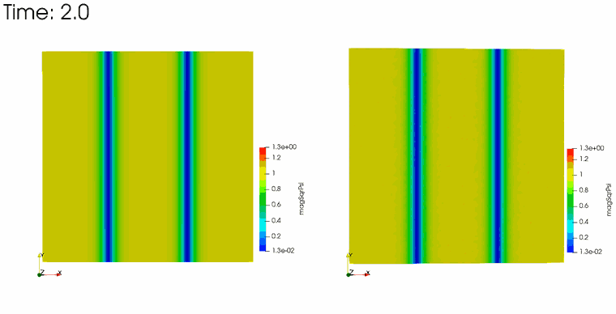

<!-- 第1回：GPソルバ schrodingerFoam を自作する -->

> **シリーズ「OpenFOAM でシュレーディンガー方程式を解く」全7回・第1回。**
> 全記事：**①ソルバ自作（本記事）**／②量子トンネル効果／③調和振動子ポテンシャル／④量子 vs 古典・波束の広がり／⑤虚時間発展で基底状態を作る／⑥走る渦対／⑦ダークソリトンの崩壊（ノイズ有無）
> リポジトリ：<https://github.com/kamakiri1225/schrodingerFoam>

OpenFOAM をカスタマイズして、**Gross–Pitaevskii（GP）方程式＝非線形シュレーディンガー方程式**を解くソルバ `schrodingerFoam` を自作します。第1回は「解きたい方程式」「何をカスタマイズするのか（`laplacianFoam` からの改造4点）」「フォルダ構成」「作成手順（コマンドを1つずつ）」「OpenFOAM 側の設定ファイルと実行方法」までを一気通貫で扱います。

最終的にこのシリーズで再現するのは、こんな量子現象です（左：摂動なし＝崩壊しない／右：白色ノイズの種あり＝渦へ崩壊）。

<p align="center">
  <br>
  <em>2本のダークソリトン（青い溝）が波打ち、点渦の集団＝量子乱流へ崩壊していく（第7回）</em>
</p>

## 解きたい方程式

冷却原子気体のボース＝アインシュタイン凝縮（BEC）は、次元付きの **Gross–Pitaevskii（GP）方程式**で記述されます。質量 $m$ の粒子の**次元付き**の式はこうです。

$$
i\hbar\,\frac{\partial \psi}{\partial t}
= -\frac{\hbar^2}{2m}\nabla^2\psi
+ V_\mathrm{ext}(\mathbf{r})\,\psi
+ g_\mathrm{3D}\,|\psi|^2\psi
$$

- $\psi(\mathbf{r},t)$：複素の波動関数（$|\psi|^2$ が粒子数密度、単位は $\mathrm{m^{-3}}$）
- $\hbar$：換算プランク定数、$m$：粒子質量
- $-\dfrac{\hbar^2}{2m}\nabla^2$：運動エネルギー項（分散）
- $V_\mathrm{ext}$：外部ポテンシャル（トラップなど。無ければ 0）
- $g_\mathrm{3D}=\dfrac{4\pi\hbar^2 a_s}{m}$：相互作用定数（$a_s$ は s 波散乱長。斥力なら $g_\mathrm{3D}>0$）。この $g_\mathrm{3D}|\psi|^2$ が**非線形項**

### 無次元化（実際に解くのはこの形）

この式のまま解くと $\hbar,m,a_s$ が数値に紛れて扱いにくいので、系に固有のスケールで割って**無次元化**します。背景密度を $n_0=|\psi_\infty|^2$、そこから決まる**化学ポテンシャル** $\mu=g_\mathrm{3D}\,n_0$ を基準にして、時間・長さ・波動関数・エネルギーを次のスケールで測り直します。

$$
\tilde t=\frac{\mu}{\hbar}\,t,\qquad
\tilde{\mathbf{r}}=\frac{\mathbf{r}}{\ell},\quad \ell=\frac{\hbar}{\sqrt{m\mu}},\qquad
\tilde\psi=\frac{\psi}{\sqrt{n_0}},\qquad
\tilde V=\frac{V_\mathrm{ext}}{\mu}
$$

長さの単位を $\ell=\hbar/\sqrt{m\mu}$ に取るのがポイントです。これを代入すると、$\partial_t=(\mu/\hbar)\partial_{\tilde t}$、$\nabla^2=\ell^{-2}\tilde\nabla^2$ から各項が $\mu\sqrt{n_0}$ でくくれて約分し、**無次元の GP 方程式**が残ります（以下チルダは省略）。

$$
i\,\frac{\partial \psi}{\partial t}
= -\frac{1}{2}\nabla^2\psi + \big(V_\mathrm{ext} + |\psi|^2\big)\psi
$$

運動項の係数がちょうど $\dfrac{\hbar^2/2m}{\ell^2\mu}=\dfrac12$、相互作用係数が $\dfrac{g_\mathrm{3D}n_0}{\mu}=1$、背景密度が $n_0=1$、化学ポテンシャルが $\mu=1$ と、すべて $O(1)$ の定数に落ちます。

本記事ではこの無次元形を、運動項の係数を文字 $D$、相互作用係数を文字 $g$ と一般化して

$$
i\,\frac{\partial \psi}{\partial t} = -D\,\nabla^2\psi + \big(V_\mathrm{ext} + g\,|\psi|^2\big)\psi,
\qquad D=\tfrac12,\ \ g=1
$$

と書きます（$D$ は $\hbar/2m$ を無次元化した運動項係数）。このときヒーリング長は $\xi=\sqrt{D/(g\,n_0)}=\sqrt{0.5}\approx0.707$、ダークソリトンの幅は $\sqrt{2}\,\xi=1$ です。格子 $\Delta x=0.25$ ならヒーリング長を約 3 格子で解像できます。

> **要点**：実際に OpenFOAM で解くのは「$\hbar=m=1$、背景密度 $=1$ にとった無次元 GP 方程式」。$D,g$ は無次元化で決まった定数（$D=1/2,\ g=1$）です。OpenFOAM は次元チェックを行うため、後述の設定ファイルでは $D$ に $\mathrm{m^2/s}$、$g$ に $\mathrm{1/s}$ という**見かけの次元**を割り当てて辻褄を合わせますが、中身はこの無次元係数です。

## 計算の全体像：2つの時間発展＝2つの方程式を解く

現象をシミュレーションするには、実は**2段階の計算**が必要です。

1. **初期状態を作る（虚時間発展）** — いきなり適当な波動関数から始めると、方程式が本来持っていない余分なエネルギー（音波など）が混ざってしまいます。そこでまず**虚時間発展**という計算で、GP 方程式に忠実な**基底状態**を作ります。これが計算のスタート地点になります（詳しくは第5回）。
2. **現象を解く（実時間発展）** — 用意した初期状態を出発点に、**実時間発展**で現象を時間を追って解きます。これが見たい本番です。

この2つは、**同じ GP 方程式を「時間の向き」だけ変えて解く2つの方程式**です。

$$
\underbrace{\frac{\partial \psi}{\partial \tau}=-(H-\mu)\psi}_{\text{虚時間：初期状態づくり}}
\qquad\Longrightarrow\qquad
\underbrace{i\,\frac{\partial \psi}{\partial t}=H\psi}_{\text{実時間：現象を解く}}
$$

ここで $H\psi\equiv-D\nabla^2\psi+(V_\mathrm{ext}+g|\psi|^2)\psi$ は両者に共通のハミルトニアン（演算子）です。**同じ $H$ を使い回せる**からこそ、ソルバ `schrodingerFoam` は 2 つの計算を**モード切替で1本にまとめられます**。虚時間発展が「なぜ初期状態を作れるのか」は第5回で詳しく説明します。

## OpenFOAM で何をカスタマイズするのか

OpenFOAM の標準ソルバに**そのままシュレーディンガー方程式を解くものはありません**。もっとも近いのは単純な拡散方程式を解く `laplacianFoam` です。

$$
\text{laplacianFoam:}\quad \frac{\partial T}{\partial t} = D\,\nabla^2 T \qquad(\text{実スカラー1本})
$$

これを土台に、以下の**4点**を改造して GP ソルバ `schrodingerFoam` を作ります。

| # | 変更点 | 中身 |
|---|--------|------|
| ① | **場を1本→2本に** | 複素数 $\psi=u+iv$ を、実スカラー場 `Psire`($u$) と `Psiim`($v$) の2本で表す |
| ② | **式を拡散→GPの連立に** | $H\phi\equiv-D\nabla^2\phi+W\phi$、$W=V_\mathrm{ext}+g\lvert\psi\rvert^2$ とすると $\partial_t u=+Hv,\ \partial_t v=-Hu$ |
| ③ | **実時間はCrank–Nicolsonに** | 前進オイラーは発散する（後述）。台形則でノルム保存させる |
| ④ | **虚時間モードを追加** | 完全陰的な拡散＋規格化。初期状態（基底状態・ソリトン）を作る |

$\psi=u+iv$ を $i\partial_t\psi=H\psi$ に代入して実部・虚部に分けると、以下の**2本の実方程式の連立**になります。これが②の中身です。

$$
\frac{\partial u}{\partial t}=+Hv,\qquad \frac{\partial v}{\partial t}=-Hu,\qquad
H\phi=-D\nabla^2\phi+\big(V_\mathrm{ext}+g(u^2+v^2)\big)\phi
$$

### なぜ前進オイラーではダメなのか（過去の失敗）

以前 `laplacianFoam` を素朴に改造し、ラプラシアンを**陽的**（`fvc::laplacian`）＝前進オイラーで時間積分した実装は**発散**しました。シュレーディンガー方程式 $\dot y=-iEy$ に前進オイラーを当てると増幅率が

$$
|1 - iE\Delta t| = \sqrt{1+(E\Delta t)^2} > 1
$$

となり、**$\Delta t$ をどれだけ小さくしても必ず 1 より大きい＝無条件不安定**だからです。そこで実時間には **Crank–Nicolson（台形則）** を使います。

$$
\left|\frac{1-iE\Delta t/2}{1+iE\Delta t/2}\right| = 1
$$

増幅率がちょうど 1、つまり**ユニタリ（ノルム保存）**。これが今回発散しない理由です（実測でもノルムが計算中ずっと一定でした）。

### ノルムが保存する理由：ケーリー変換

なぜ Crank–Nicolson だと増幅率がちょうど 1 になるのか。もう少し踏み込みます。シュレーディンガー方程式 $\partial_t\psi=-iH\psi$ の厳密な時間発展は $\psi^{n+1}=e^{-iH\Delta t}\psi^n$ で、$H$ がエルミート（実固有値）なので $e^{-iH\Delta t}$ は**ユニタリ＝ノルムを変えません**。Crank–Nicolson は、この時間微分を両端の平均で近似します。

$$
\frac{\psi^{n+1}-\psi^n}{\Delta t}=-iH\,\frac{\psi^{n+1}+\psi^n}{2}
$$

$\psi^{n+1}$ について解くと、更新式はこうなります。

$$
\psi^{n+1}=\frac{I-\tfrac{i}{2}H\Delta t}{I+\tfrac{i}{2}H\Delta t}\,\psi^{n}
$$

この $\dfrac{I-\tfrac{i}{2}H\Delta t}{I+\tfrac{i}{2}H\Delta t}$ という形が **ケーリー変換（Cayley transform）** です。エルミート演算子 $H$ をこの分数に入れると、結果は必ず**ユニタリ演算子**になります。実際、$H$ の固有値 $E$（実数）に対して分子と分母の大きさは等しく $\sqrt{1+(E\Delta t/2)^2}$ なので、比の大きさはちょうど 1。これが「増幅率＝1、ノルム保存」の正体です。

ケーリー変換は、厳密な時間発展 $e^{-iH\Delta t}$ の**有理近似（パデ近似）でありながら、ユニタリ性だけは厳密に保つ**のが利点です。前進オイラーの $I-iH\Delta t$（大きさ $\sqrt{1+(E\Delta t)^2}>1$）とは、ここが決定的に違います。本ソルバの実時間モードは、この台形則を後述の反復で解くことで、ケーリー変換に対応する更新を実現しています。

### OpenFOAM 組み込みの `CrankNicolson` を使わない理由

「OpenFOAM には `ddtSchemes` に組み込みの `CrankNicolson` があるのに、なぜ手組みするのか」という疑問はもっともです。理由は次のとおりです。

- **単一場向けのスキームだから**：組み込み `CrankNicolson` は `fvm::ddt(φ)` に作用し、「同じ場 φ の時間微分と空間項」を中心化する、拡散・移流のような**単一場**の陰的方程式を想定しています。一方シュレーディンガー方程式は $\partial_t u=+Hv,\ \partial_t v=-Hu$ と**時間微分が“相手の場”に結びつく連立系**なので、`fvm::ddt - fvm::laplacian` の単一場の形にはそのまま載りません。
- **欲しいのは時間の中心化ではなくユニタリ性だから**：u と v を分離（segregated）して各式に組み込み CN を当てると、相手場の寄与が前ステップ値（ラグ）で入り、中点で自己無撞着にならず**ノルム保存が厳密には崩れます**。厳密にするには結局「中点が収束するまで回す」反復が必要で、それが本ソルバの `nCorrectors`（Picard 反復）です。非線形項 $W=V_\mathrm{ext}+g\lvert\psi\rvert^2$ の中点更新も同じ反復で処理します。
- **実装上のクセ**：組み込み CN はロバスト性のためオイラーへブレンドする係数を持ち、純 CN は振動しやすいので実務では係数を 1 未満に落として使うことが多いです。「厳密に増幅率 1」を狙う本用途では、透明性・厳密性の両面で手組みが扱いやすいという判断です。

なお `imaginaryTime` 側は**単一場の実の拡散方程式**なので、素直に `fvm::ddt`（完全陰的）で解いています。`fvSchemes` の `ddtSchemes { default Euler; }` はこの虚時間側のためのもので、実時間側は時間積分を手で組むため影響しません。

### 位相のチラつきを消す：化学ポテンシャルの差し引き（回転系）

実時間発展の結果を**位相 $\arg\psi$ で可視化**すると、渦やダークソリトンの構造とは別に、画面全体の色が周期的に**チカチカと点滅**することがあります。これは背景の凝縮体がもつ**大域位相 $e^{-i\mu t}$** の回転です。

波動関数を「速い大域位相」と「ゆっくりした中身」に分けます。

$$
\psi(\mathbf r,t)=e^{-i\mu t}\,\phi(\mathbf r,t),\qquad
\mu=\text{背景の化学ポテンシャル}\ (\text{本設定では}\ g\,n_0=1)
$$

位相は $\arg\psi=-\mu t+\arg\phi$ となり、第1項 $-\mu t$ は**空間的に一様なまま時間で回る**ため、位相カラーマップ上では全面が周期 $2\pi/\mu$ で全色を巡回＝点滅して見えます。この大域位相は**物理的に観測できない**量です（意味を持つのは位相の空間勾配＝速度と、渦まわりの $2\pi$ 巻きだけ）。だから消してしまって構いません。

参照したカマキリ記事の Fortran コードは、実時間発展を $H$ ではなく $H-\mu$ で解くことでこれを行っています（コード中の `- mu*f` の項）。

$$
i\,\frac{\partial\psi}{\partial t}=(H-\mu)\psi
$$

これは大域位相の回転と一緒に回る**回転系（co-rotating frame）**へ移る操作で、背景の位相が止まり、位相図は**渦核やソリトンの位相構造だけ**がくっきり見えるようになります。密度 $\lvert\psi\rvert^2$ は大域位相に不変なので、密度アニメには元々チラつきは出ません（チラつくのは位相図だけ）です。

本ソルバの `realTime` は既定では $i\partial_t\psi=H\psi$（$\mu$ を引かない素の形）で解いているため、位相図が点滅します。位相をきれいに見せたいときは、`constant/gpProperties` で**化学ポテンシャルを考慮するオプション**を選べます（**物理＝密度・渦の運動は一切変わりません**）。

```c
// (A) 引かない：既定。i dPsi/dt = H Psi（後方互換）
dynamicMu       false;
muShift         0.0;

// (B) 定数を引く：一様背景（渦・ダークソリトン）は mu = g*n0 = 1 が既知
dynamicMu       false;
muShift         1.0;

// (C) 動的に求める：毎ステップ mu = <Psi|H|Psi>/<Psi|Psi> を計算（トラップ系向き）
dynamicMu       true;    // muShift は無視される
```

- **(B) 定数 `muShift`**：背景が一様な系（ダークソリトンや渦）では $\mu=g\,n_0$ が既知なので、この値を引くのが簡単・安定。
- **(C) `dynamicMu true`**：`imaginaryTime` と同じ要領で毎ステップ $\mu=\langle\psi|H|\psi\rangle/\langle\psi|\psi\rangle$ を計算して引く。$\mu$ が自明でないトラップ系などで有効。

内部的には `realTime` の $W\ (=V_\mathrm{ext}+g\lvert\psi\rvert^2)$ を $W-\mu$ に置き換えているだけで、Crank–Nicolson の枠組みはそのままです（虚時間側はもともと $W-\mu$ を解いているので変更なし）。実行ログには各ステップの `muShift =` が表示されます。

## フォルダ構成

```
schrodingerFoam/          ← ソルバ本体
  schrodingerFoam.C           メイン（realTime / imaginaryTime の2モード）
  createFields.H              場（Psire, Psiim, Vext, magSqrPsi, phase）の定義
  Make/{files,options}        ビルド設定
run/                      ← 計算ケース（各フォルダに README.md 仕様書つき）
  00_1_tunneling_1D/          1D 量子トンネル効果（第2回）
  00_2_harmonicOscillator_1D/ 1D 調和振動子・コヒーレント状態（第3回）
  00_3_release2D/             2D 波束の自由膨張・量子 vs 古典（第4回）
  01_darkSoliton_realTime/    ダークソリトン → 渦核（cos 摂動で種付け／第7回）
  02_trap_imaginaryTime/      虚時間：調和トラップの基底状態（第5回）
  03_vortexDipole_realTime/   走る渦対（渦-反渦ダイポール／第6回）
  04_darkSoliton_noSeed/      対照：摂動なし → 崩壊しない（第7回）
  04_darkSoliton_whiteNoise/  白色ノイズの種 → 不規則な渦崩壊（第7回）
tools/render.py           ← VTK → PNG → GIF の可視化スクリプト
figures/                  ← 結果 GIF・図（run と同じ連番で対応）
notes.md                  ← 詳しい作業メモ
```

## 作成手順（コマンドを1つずつ解説）

まず OpenFOAM v2512 の環境に入ります。ターミナルで `openfoam2512` と打つと、プロンプトが環境内に切り替わります。以降の手順は**この環境の中で**実行し、終わったら `exit` で抜けます。

```bash
# OpenFOAM v2512 環境に入る（プロンプトが変わる）
openfoam2512
```

> 1コマンドだけを非対話で流したいときは、環境に入らず `openfoam2512 -c '<コマンド>'` と書くこともできます。以下は環境に入った状態で説明します。

### 手順① ソルバの雛形を作る

環境の中で、`laplacianFoam` のソースをユーザ領域にコピーして出発点にします。

```bash
# （openfoam2512 環境の中で）laplacianFoam を丸ごとコピー
cp -r $FOAM_SOLVERS/basic/laplacianFoam schrodingerFoam
```

`$FOAM_SOLVERS` は OpenFOAM 標準ソルバのソース置き場。`laplacianFoam`（拡散ソルバ）を丸ごとコピーして、これを改造していきます。

### 手順② 場の定義を書き換える（`createFields.H`）

`T` 1本を消し、`Psire`・`Psiim` の2本と、外部ポテンシャル `Vext`、後処理用の `magSqrPsi`($|\psi|^2$)・`phase`($\arg\psi$) を追加します。係数 `D`・`g` は `constant/gpProperties` から読みます。OpenFOAM の場は `IOobject`（名前・読み書きのルール）と初期値をセットで渡して作ります。実際の `createFields.H` は次のとおりです（省略なし）。

```cpp
// constant/gpProperties を読む辞書オブジェクト
IOdictionary gpProperties
(
    IOobject
    (
        "gpProperties", runTime.constant(), mesh,
        IOobject::MUST_READ_IF_MODIFIED, IOobject::NO_WRITE
    )
);

// 物理係数：gpProperties から次元つきで読む
dimensionedScalar D("D", dimensionSet(0, 2, -1, 0, 0, 0, 0), gpProperties); // hbar/2m [m^2/s]
dimensionedScalar g("g", dimensionSet(0, 0, -1, 0, 0, 0, 0), gpProperties); // 非線形係数 [1/s]

// 実部 u：0/Psire を必ず読む（MUST_READ）、毎ステップ書き出す（AUTO_WRITE）
volScalarField Psire
(
    IOobject
    (
        "Psire", runTime.timeName(), mesh,
        IOobject::MUST_READ, IOobject::AUTO_WRITE
    ),
    mesh
);

// 虚部 v：Psire と同じ扱い
volScalarField Psiim
(
    IOobject
    (
        "Psiim", runTime.timeName(), mesh,
        IOobject::MUST_READ, IOobject::AUTO_WRITE
    ),
    mesh
);

// 外部ポテンシャル：0/Vext があれば読む（READ_IF_PRESENT）、無ければ 0 で作る
volScalarField Vext
(
    IOobject
    (
        "Vext", runTime.timeName(), mesh,
        IOobject::READ_IF_PRESENT, IOobject::NO_WRITE
    ),
    mesh,
    dimensionedScalar("zero", dimensionSet(0, 0, -1, 0, 0, 0, 0), Zero)  // 既定値 0
);

// 後処理用：密度 |Psi|^2 は読まずに計算で作り（NO_READ）、書き出す（AUTO_WRITE）
volScalarField magSqrPsi
(
    IOobject
    (
        "magSqrPsi", runTime.timeName(), mesh,
        IOobject::NO_READ, IOobject::AUTO_WRITE
    ),
    sqr(Psire) + sqr(Psiim)   // 初期値をその場で計算
);

// 後処理用：位相 arg(Psi)。渦の検出に使う
volScalarField phase
(
    IOobject
    (
        "phase", runTime.timeName(), mesh,
        IOobject::NO_READ, IOobject::AUTO_WRITE
    ),
    mesh,
    dimensionedScalar("zero", dimless, Zero)
);
```

`IOobject` の第4・第5引数が「読み方・書き方」のルールです。ここだけ押さえれば十分です。

| フラグ | 意味 | 使っている場 |
|--------|------|------------|
| `MUST_READ` | 起動時に `0/` のファイルを**必ず読む**（無ければエラー） | `Psire`, `Psiim`（初期波動関数） |
| `READ_IF_PRESENT` | ファイルが**あれば読む・無ければ既定値で作る** | `Vext`（ポテンシャル無しなら 0） |
| `NO_READ` | 読まずに、コードで与えた初期値で作る | `magSqrPsi`, `phase`（計算で求める量） |
| `AUTO_WRITE` | 出力時刻ごとに**自動で書き出す** | 上記すべて（後で可視化する） |
| `NO_WRITE` | 書き出さない | `Vext`（時間変化しないので不要） |

次元は `laplacianFoam` の `DT`（m²/s）に倣い、`D` を m²/s、`g`・`Vext` を 1/s とすると、`fvm::ddt` と `fvm::laplacian(D,·)` の次元が揃い、OpenFOAM の次元チェックが通ります（第1章で触れた「見かけの次元」がこれです）。

### 手順③ 解く式を GP に書き換える（`schrodingerFoam.C`）

`mode` で分岐させます。**実時間（realTime）**は Crank–Nicolson を Picard（Gauss–Seidel）反復で解きます。

```cpp
const volScalarField Psire0(Psire), Psiim0(Psiim);            // n ステップ目を保存
const volScalarField Hv0(-D*fvc::laplacian(Psiim0) + W0*Psiim0);
const volScalarField Hu0(-D*fvc::laplacian(Psire0) + W0*Psire0);

for (int corr = 0; corr < nCorr; ++corr)                     // 外部反復
{
    volScalarField W(Vext + g*(sqr(Psire) + sqr(Psiim)));    // W = V + g|psi|^2 更新
    const volScalarField Hv(-D*fvc::laplacian(Psiim) + W*Psiim);
    Psire = Psire0 + 0.5*dt*(Hv + Hv0);                      // u の CN 更新
    Psire.correctBoundaryConditions();

    W = Vext + g*(sqr(Psire) + sqr(Psiim));                  // 更新した u で W 再計算
    const volScalarField Hu(-D*fvc::laplacian(Psire) + W*Psire);
    Psiim = Psiim0 - 0.5*dt*(Hu + Hu0);                      // v の CN 更新
    Psiim.correctBoundaryConditions();
}
```

ここは $H$ を**値として**評価する `fvc::`（陽的）を使い、$u\leftrightarrow v$ の結合と非線形項 $W$ を反復で自己無撞着に埋めます。CN なので増幅率がちょうど 1、ノルムが保存します。

**虚時間（imaginaryTime）**は、$\partial_\tau\psi=D\nabla^2\psi-(W-\mu)\psi$ という**実の拡散方程式**なので、`laplacianFoam` と同じ **`fvm::`（陰的）** がそのまま使えて**無条件安定**（大きな $\Delta\tau$ が取れる）。詳しい仕組みと結果は第5回で扱います。

```cpp
volScalarField W("W", Vext + g*(sqr(Psire) + sqr(Psiim)));
// 化学ポテンシャル mu = <psi|H|psi> / <psi|psi>
dimensionedScalar mu =
    fvc::domainIntegrate(Psire*Hre + Psiim*Him)
  / fvc::domainIntegrate(sqr(Psire) + sqr(Psiim));

solve( fvm::ddt(Psire) - fvm::laplacian(D, Psire) + fvm::SuSp(W - mu, Psire) ); // 陰的
solve( fvm::ddt(Psiim) - fvm::laplacian(D, Psiim) + fvm::SuSp(W - mu, Psiim) );

if (normalize) { /* 毎ステップ ∫|psi|^2 = targetNorm に規格化 */ }
```

### fvm と fvc の使い分けが肝

| 場所 | 演算子 | なぜ |
|------|--------|------|
| 虚時間のラプラシアン | `fvm::laplacian`（陰的） | 実拡散なので陰的が無条件安定、大 $\Delta\tau$ 可 |
| 実時間のラプラシアン | `fvc::laplacian`（陽的）＋CN＋反復 | $u,v$ 結合を分離して解くため。CN でノルム保存 |
| 過去の失敗 | `fvc::laplacian`＋前進オイラー | ノルムが必ず増える＝無条件不安定 |

### 手順④ ビルドする

```bash
# （openfoam2512 環境の中で）ソルバをビルド
cd schrodingerFoam
wmake
```

`wmake` が `Make/files`（実行ファイル名）と `Make/options`（リンクするライブラリ）を読んでコンパイルします。成功すると `$FOAM_USER_APPBIN/schrodingerFoam` が生成され、以後どのケースでも `schrodingerFoam` コマンドで呼べます。

## OpenFOAM 側のファイル設定

ソルバができたら、各ケースは OpenFOAM の標準構成 `0/`（初期条件）・`constant/`（物性）・`system/`（数値設定）で動かします。ここでは `run/01_darkSoliton_realTime` を例に、要点だけ見ます（各ケース固有の設定は第2〜7回でそれぞれ紹介します）。

### `constant/gpProperties` — 物理係数とモード（自作）

```c
D               D  [0 2 -1 0 0 0 0]  0.5;   // 分散係数 D = hbar/2m
g               g  [0 0 -1 0 0 0 0]  1.0;   // 非線形結合定数（>0 で斥力）
mode            realTime;                   // realTime | imaginaryTime
nCorrectors     4;                          // Crank-Nicolson の Picard 反復回数
normalize       false;                      // 規格化（主に虚時間の基底状態探索用）
targetNorm      1.0;
convergenceTol  0;                          // 場が変化しなくなったら停止（0=しない）
```

`mode` を `imaginaryTime` にすれば、同じソルバが虚時間発展（初期状態づくり）に変わります。

### 虚時間発展・実時間発展の使い分け（設定と実行）

同じソルバ・同じ実行コマンドのまま、`mode` を替えるだけで2つの計算を切り替えられます。設定の要点と実行方法を並べます。

| 項目 | 虚時間発展（初期状態づくり） | 実時間発展（本計算） |
|------|------------------------------|----------------------|
| `mode` | `imaginaryTime` | `realTime` |
| 目的 | 基底状態・ソリトン背景を作る | 現象を時間発展させる |
| `normalize` | `true`（粒子数を固定） | `false` |
| `targetNorm` | 目標ノルム（例 `20`） | 使わない |
| `convergenceTol` | `1e-5` など（収束で自動停止） | `0`（最後まで回す） |
| `nCorrectors` | 使わない（完全陰的） | `4`（Crank–Nicolson 反復） |
| `muShift`／`dynamicMu` | 内部で $\mu$ を自動計算 | 位相可視化に応じて任意（前節） |
| 時間刻み | 大きく取れる（$\Delta\tau$ 大） | $\Delta t\lesssim\Delta x^2/D$ |

実行コマンドは**どちらのモードも同じ**です（`mode` の値だけ違う）。

```bash
# openfoam2512 環境の中で
cd run/<ケース名>
blockMesh          # メッシュ生成（初回のみ）
schrodingerFoam    # constant/gpProperties の mode に従って計算
```

- **虚時間**：ログに毎ステップ `mu` と `norm` が表示され、`convergenceTol` を下回ると `Converged` と出て**自動停止**します。得られた最終時刻の場が「作った初期状態」です。
- **実時間**：ログに毎ステップ `norm`（と `muShift`）が表示され、`endTime` まで回ります。ノルムが一定なら安定に解けている証拠です。

**典型的な2段階の流れ**は「①虚時間で初期状態を作る → ②その場を出発点に `mode` を `realTime` に替えて本計算」です（実例は第5回）。本シリーズの多くのケースは初期状態を `#codeStream` で直接与えているため①を省けますが、トラップ基底状態のように解析形が面倒なときは虚時間で作ります。

### `system/blockMeshDict` — メッシュ

2次元ケースでは $[-16,16]^2$ を $128\times128$ に切り、z 方向1層の疑似2次元にします。ソリトンの snake instability を扱うには `cyclic`（周期境界）で無限系のように振る舞わせます。1次元ケース（第2・3回）では x だけを分割し、y・z を単一セルの `empty` にします。

### `system/fvSchemes` — 離散化スキーム

```c
ddtSchemes        { default Euler; }                    // 時間：1次前進
divSchemes        { default none; }                     // 移流項なし → none
laplacianSchemes  { default Gauss linear corrected; }   // 2次・非直交補正
```

移流（div）項がないのが GP 方程式の特徴で、`divSchemes` は `none` で構いません。

### `system/controlDict` — 時間刻みと出力

```c
application     schrodingerFoam;
deltaT          0.005;      // Picard 収束のため dt <~ dx^2/D が目安
writeInterval   1;
```

$\Delta t=0.005$：実時間の分離陽的ラプラシアンは Picard 収束のため $\Delta t\lesssim\Delta x^2/D$ が目安（$\Delta x=0.25,\ D=0.5$ なら $\sim0.125$、余裕を見て小さめ）。

### `0/Psire`・`0/Psiim` — 初期条件（`#codeStream` で解析生成）

初期状態は、OpenFOAM 内でその場でコンパイルされる `#codeStream` で作ります。例えばダークソリトン対なら 2 本の $\tanh$ の溝＋横方向の cos 摂動（snake の種）です。

```cpp
const scalar w = 1.0, x0 = 6.0, A = 0.25, lamY = 8.0;
forAll(psi, i)
{
    const scalar x = mesh.C()[i].x(), y = mesh.C()[i].y();
    const scalar sh = A*Foam::cos(twoPi*y/lamY);          // 溝の横ずれ
    psi[i] = Foam::tanh((x+x0-sh)/w) * Foam::tanh((x-x0-sh)/w);
}
```

## 計算の実行方法

```bash
# （openfoam2512 環境の中で）① メッシュ生成 → ② 計算実行
cd run/01_darkSoliton_realTime
blockMesh
schrodingerFoam
```

実行中は各ステップの `norm`（虚時間なら `mu` も）が表示され、ノルムが一定なら安定に解けている証拠です。計算後、結果を VTK に出します（ここまで環境の中）。

```bash
# （openfoam2512 環境の中で）③ 場を ascii の VTK (.vtu) に書き出し
foamToVTK -fields "(magSqrPsi phase)" -ascii
```

最後の GIF 化は OpenFOAM 環境の外（ふつうのターミナル）で行います。`exit` で環境を抜けてから実行してください。

```bash
# 環境の外（ホスト）で ④ VTK → PNG連番 → GIF
python3 tools/render.py run/01_darkSoliton_realTime/VTK figures/01_darkSoliton_realTime/density magSqrPsi
```

`render.py` は `internal.vtu` を読み、セル中心座標から一様格子に並べ替えて `matplotlib` でヒートマップ化し、`Pillow` で GIF に結合します。

---

次回（第2回）は、この `schrodingerFoam` で**1次元の量子トンネル効果**を計算します。運動量を持ったガウス波束が、古典的には越えられない壁を「すり抜ける」様子を可視化します。
