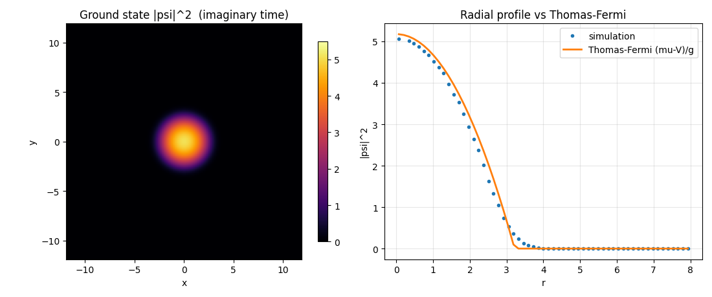

<!-- 第5回：虚時間発展で基底状態を作る -->

> **シリーズ「OpenFOAM でシュレーディンガー方程式を解く」全7回・第5回。**
> ①ソルバ自作／②量子トンネル効果／③調和振動子ポテンシャル／④量子 vs 古典・波束の広がり／**⑤虚時間発展で基底状態を作る（本記事）**／⑥走る渦対／⑦ダークソリトンの崩壊（ノイズ有無）
> リポジトリ：<https://github.com/kamakiri1225/schrodingerFoam>／ケース：`run/02_trap_imaginaryTime`

第1回で「シミュレーションには**初期状態づくり（虚時間発展）**と**本計算（実時間発展）**の 2 段階が必要」と述べました。今回はその前半、**虚時間発展（imaginary-time evolution）**が「なぜ基底状態を作れるのか」を説明し、実際に調和トラップの基底状態を計算して理論と比べます。

<p align="center">
  <br>
  <em>虚時間発展で得た基底状態の密度分布と、Thomas–Fermi 近似との比較</em>
</p>

## なぜ初期状態づくりが必要か

現象を正しくシミュレーションするには、GP 方程式に**忠実な初期状態**から始める必要があります。いきなり適当な波動関数を置くと、方程式が本来持っていない余分なエネルギー（音波＝フォノン）が混ざり、見たい現象が汚れてしまいます。そこでまず、いちばん落ち着いた状態＝**基底状態**を作ります。その道具が虚時間発展です。

## アイデア：時間を虚軸に倒す

ハミルトニアン $H$ の固有状態を $H\phi_n=E_n\phi_n$（$E_0<E_1<\cdots$）とし、任意の初期状態を重ね合わせで書きます。

$$
\psi=\sum_n c_n\phi_n
$$

**実時間**のシュレーディンガー方程式の解は

$$
\psi(t)=\sum_n c_n\,e^{-iE_n t}\,\phi_n
$$

各成分は**大きさを変えず位相だけ回る**（$|e^{-iE_nt}|=1$）ので、いつまで待っても基底状態には落ちません。ここで $t\to -i\tau$（時間を虚軸へ倒す）と置き換えると、位相回転が**指数減衰**に化けます。

$$
\psi(\tau)=\sum_n c_n\,e^{-E_n\tau}\,\phi_n
$$

## 高エネルギー成分ほど速く消える → 基底状態が残る

$E_n$ が大きいほど $e^{-E_n\tau}$ は速く小さくなります。基底状態 $E_0$ を括り出すと、

$$
\psi(\tau)=e^{-E_0\tau}\Big(c_0\phi_0+\underbrace{c_1e^{-(E_1-E_0)\tau}\phi_1+\cdots}_{\tau\to\infty\ \text{で}\ 0}\Big)
$$

$E_1-E_0>0$ なので、$\tau\to\infty$ で励起成分は基底成分に対して**相対的に**消え、$\psi\propto\phi_0$（基底状態）へ収束します。

## 規格化で全体の減衰を打ち消す

このままだと全体が $e^{-E_0\tau}$ で 0 に縮んでしまうので、**毎ステップ規格化**して $\int|\psi|^2=$一定 に戻します。これは全体の指数因子を割り算で消す操作で、「基底状態が相対的に優勢になる」効果だけが残ります。式で書くと、規格化つき虚時間発展は

$$
\frac{\partial\psi}{\partial\tau}=-(H-\mu)\psi,\qquad
\mu=\frac{\langle\psi|H|\psi\rangle}{\langle\psi|\psi\rangle}
$$

に等しく、収束すると $H\psi=\mu\psi$、すなわち**定常状態（基底状態）**に到達します。$\mu$ は規格化を保つための化学ポテンシャルです。

> **一言でいうと**：実時間 $e^{-iEt}$（位相が回るだけ）を、虚時間 $e^{-E\tau}$（振幅が減る）に化けさせ、高エネルギー成分を優先的に捨てるのが虚時間発展。規格化を挟めば「最低エネルギー＝基底状態」だけが残り、これを初期状態に使えます。

この $\partial_\tau\psi=D\nabla^2\psi-(W-\mu)\psi$ はふつうの**拡散方程式と同じ形**なので、`laplacianFoam` 由来の `fvm::`（陰的）でそのまま解け、**無条件安定**（大きな $\Delta\tau$ が取れる）。第1回で示したソルバの `imaginaryTime` モードがこれです。

## 計算：調和トラップの基底状態

`mode imaginaryTime` で調和トラップ $V=\tfrac12 r^2$ の基底状態を求めます。

- 設定：$[-12,12]^2$・$128^2$・壁境界、$\Delta\tau=0.05$、`normalize` ＋ `targetNorm 20` ＋ `convergenceTol 1e-5`。
- 適当な初期分布から出発し、虚時間発展で基底状態へ収束させる。

結果、化学ポテンシャルは $\mu\to5.17$ に落ち着きました。相互作用が強いとき（$g|\psi|^2$ が運動エネルギーを上回るとき）の解析的な近似である**Thomas–Fermi 近似**

$$
n(r)=\frac{\mu-\tfrac12 r^2}{g}
$$

と、得られた密度分布がよく一致します（上図）。これは、第1〜4回で「厳密解を `#codeStream` で直接与えていた」初期状態を、**虚時間発展が自動で作れる**ことの定量的な裏付けであり、虚時間発展が正しく実装できている証拠です。

## 実行手順

```bash
openfoam2512 -c 'cd run/02_trap_imaginaryTime && blockMesh && schrodingerFoam'
```

実行中は各ステップで化学ポテンシャル $\mu$ とノルムが表示され、$\mu$ が一定値に収束し残差が `convergenceTol` を下回った時点で停止します。この基底状態を出発点にすれば、あとは `mode realTime` に切り替えて本番の現象（第6・7回）を解けます。

---

次回（第6回）は実時間発展に戻り、**渦と反渦のペア（渦対）が一定速度で走る**様子を計算します。「なぜ渦対は進むのか」を単独で示すデモです。
