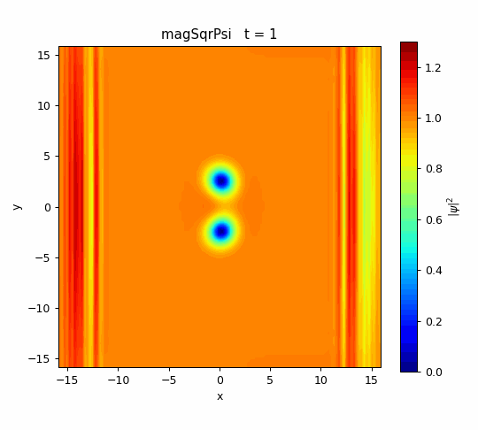
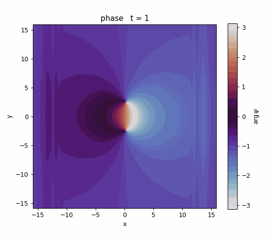
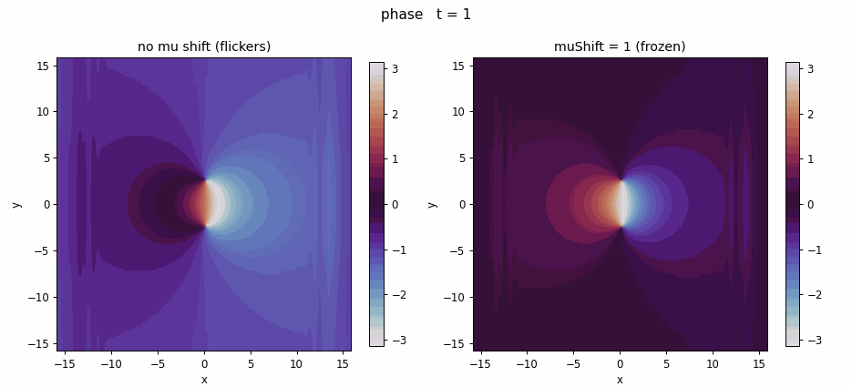

<!-- 第6回：走る渦対（渦-反渦ダイポール） -->

> **シリーズ「OpenFOAM でシュレーディンガー方程式を解く」全7回・第6回。**
> ①ソルバ自作／②量子トンネル効果／③調和振動子ポテンシャル／④量子 vs 古典・波束の広がり／⑤虚時間発展で基底状態を作る／**⑥走る渦対（本記事）**／**総集編（第0回）：全体ダイジェスト（ダークソリトン崩壊まで）**
> リポジトリ：<https://github.com/kamakiri1225/schrodingerFoam>／ケース：`run/03_vortexDipole_realTime`

ここからは 2 次元・相互作用あり（$g=1$）の GP 方程式で、**量子渦**を扱います。今回は、渦と反渦のペア（**渦対＝ダイポール**）が、互いの作る流れに乗って**一定速度で並進する**様子を計算します。

| 密度 $\lvert\psi\rvert^2$ | 位相 $\arg\psi$ |
|:---:|:---:|
|  |  |

## 量子渦とは

超流動（BEC）では、渦は好き勝手な強さを取れず、**位相が渦のまわりを1周すると $2\pi$ の整数倍だけ変化する**、という量子化条件を満たします。渦の中心では密度が 0 になり（位相が定義できないため）、位相図では中心のまわりを色が $2\pi$ 巻きます。巻く向きが $+1$ なら渦、$-1$ なら反渦です。

単独の渦はその場に留まりますが、**渦（+1）と反渦（−1）が近くに対を作る**と、互いが相手の位置に作る流れに乗って、**対全体が一定速度でまっすぐ進みます**。これが渦対（vortex dipole）です。水中で 2 つの逆回転の渦輪が並んで進むのと同じ原理です。

## 初期状態：位相の刷り込み

渦対は、背景の一様な凝縮体に**位相だけを刷り込む**ことで作ります。間隔 $d$ で置いた $+1$ と $-1$ の渦の位相場を、それぞれの点を中心とする偏角の和として与え、密度は渦芯付近だけ 0 に落とします。

$$
\arg\psi(\mathbf r)=\arg\big[(x-x_+) + i(y-y_+)\big]-\arg\big[(x-x_-)+i(y-y_-)\big]
$$

これを `#codeStream` で `0/Psire`・`0/Psiim` に書き込みます。$+1$ と $-1$ を上下にずらして間隔 $d=2.5$ の渦-反渦対を配置しました。

## 数値設定

- 領域 $[-16,16]^2$・$128^2$・**周期境界**（`cyclic`）、$\Delta t=0.005$、$t\le80$。
- realTime（Crank–Nicolson＋`nCorrectors 4`）、$D=0.5$、$g=1$。

## 結果：一定速度で並進

渦対は形を保ったまま、**一定速度で並進**しました。実測速度 $\approx0.25$ は、渦対の並進速度の理論値

$$
v\sim\frac{\hbar/m}{2d}
$$

（無次元では $D/d$ 相当）とよく一致します。「なぜ渦対は走るのか」を単独で示すデモになっています。

位相図（右）では、進みながら 2 つの位相特異点（$+2\pi$ と $-2\pi$ の巻き）がペアで移動していく様子がはっきり見えます。

> **位相図がチカチカするとき**：実時間発展では背景全体が大域位相 $e^{-i\mu t}$ で回るため、位相カラーマップが周期的に点滅して見えます。これは物理的に無意味な大域位相なので、$H$ の代わりに $H-\mu$ を解く（回転系へ移る）と背景の色が止まり、渦の位相構造だけがくっきり見えます。仕組みと実装は第1回「位相のチラつきを消す：化学ポテンシャルの差し引き」を参照。密度図には影響しません。

実際に $\mu$ を引いた版を `03_1_vortexDipole_muShift`（`muShift 1`）として用意しました。下は位相 $\arg\psi$ の比較で、**左＝μ引かない（背景が点滅）／右＝μ引く（背景が静止）**。密度・渦の運動は両者でまったく同一で、変わるのは位相の見え方だけです。

<p align="center">
  <br>
  <em>位相 arg ψ：左＝μ引かない（点滅）／右＝μ引く（静止）</em>
</p>

> **背景の縦縞について**：位相刷り込みは GP 方程式の厳密解ではないため、初期に少量の音波（フォノン）が放出されます。これが背景のさざ波として見えますが、渦対の並進そのものには影響しません。より清浄にしたい場合は、刷り込み後に短く虚時間発展（第5回）をかけて背景を整えます。

## 実行手順

```bash
openfoam2512 -c 'cd run/03_vortexDipole_realTime && blockMesh && schrodingerFoam'
openfoam2512 -c 'cd run/03_vortexDipole_realTime && foamToVTK -fields "(magSqrPsi phase)" -ascii'
python3 tools/render.py run/03_vortexDipole_realTime/VTK figures/03_vortexDipole_realTime/density magSqrPsi
python3 tools/render.py run/03_vortexDipole_realTime/VTK figures/03_vortexDipole_realTime/phase   phase
```

---

これで本編（第1〜6回）は完結です。シリーズの目標だった**ダークソリトンの崩壊**——まっすぐな溝が波打って（snake instability）多数の量子渦に分裂する過程と、「崩壊には何が必要か（種の有無）」——を含むシリーズ全体の流れは、**総集編（第0回）：全体ダイジェスト**にまとめています。まだの方はそちらから読むと、各回の位置づけが一望できます。
