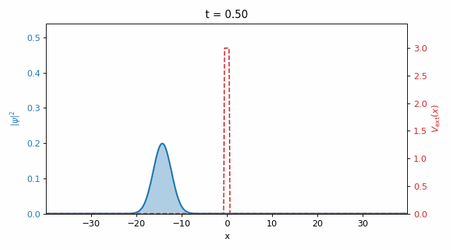
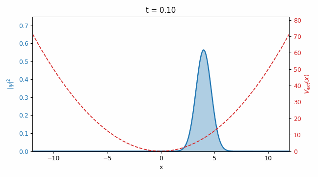
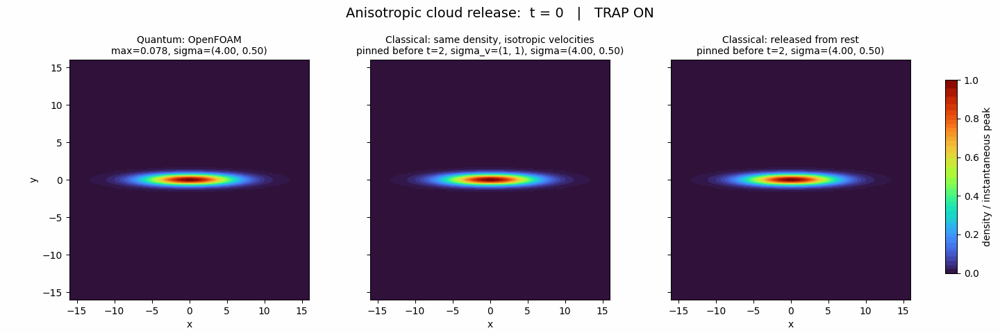
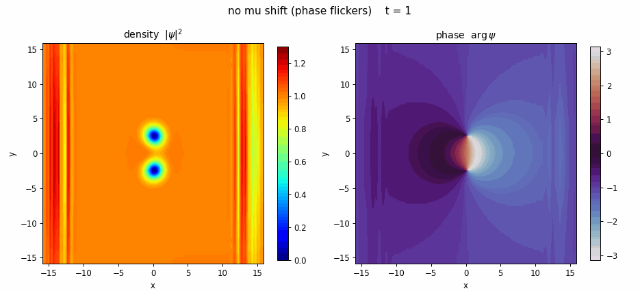
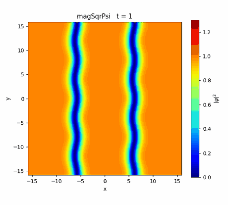
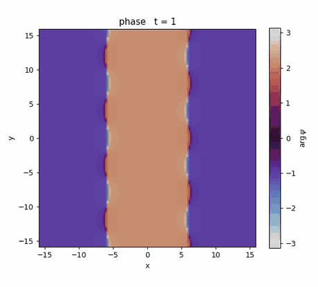

# なぜ流体ソルバでシュレーディンガー方程式が解けるのか

「OpenFOAM で量子力学を解く」と言うと、たいてい怪訝な顔をされます。OpenFOAM は流体解析（CFD）のツールで、量子力学とは畑違いに見えるからです。でも、これは半分だけ誤解です。

OpenFOAM の正体は、**偏微分方程式（PDE）を解くためのフレームワーク**です。流れの方程式（ナビエ–ストークス）も、熱伝導も、波動も、中身はすべて「時間と空間の微分でつながった量」を数値的に追いかけているだけ。そして量子力学の基礎方程式である**シュレーディンガー方程式もまた、時間微分と空間微分でできた PDE** です。

$$
i\,\partial_t\psi = -D\,\nabla^2\psi + \big(V_\mathrm{ext} + g|\psi|^2\big)\psi
$$

左辺が時間微分、右辺の $\nabla^2$ が空間の2階微分。形だけ見れば、拡散方程式に $i$（虚数）が付いて、ポテンシャル項が乗ったものです。つまり**方程式さえ書き下せれば、馴染みの薄い量子力学も、流体解析とまったく同じ土俵で解ける**——この記事はそれを実際にやってみたシリーズ全7回の総まとめです。

最後には、シリーズの目標だった現象、**2次元ダークソリトンの崩壊**（まっすぐな溝が波打って多数の量子渦にちぎれる現象）まで、手元の自作ソルバで再現します。

<p align="center">
  <br>
  <em>本シリーズのゴール：左＝きれいな溝（崩壊しない）／右＝ノイズを与えると量子渦へ崩壊</em>
</p>

> **この記事でわかること**
> - なぜ CFD ツールの OpenFOAM で量子力学（シュレーディンガー方程式）が解けるのか
> - 既存ソルバ `laplacianFoam` を4ステップ改造して自作ソルバ `schrodingerFoam` を作る全体像
> - トンネル効果・調和振動子・波束の広がり・虚時間発展・量子渦・ダークソリトン崩壊——全7回の結果ダイジェスト
> - 「きれいなダークソリトンは自分から崩れない」——崩壊に何が必要かを対照実験で確かめる

## こんな人に読んでほしい

- OpenFOAM は使えるが、流体以外に応用できると思っていなかった人
- 量子力学のシミュレーションに興味はあるが、専用コードを一から書くのは荷が重いと感じている人
- 「シュレーディンガー方程式を数値で解く」と聞いてもピンとこない人
- BEC・超流動・量子渦・ダークソリトンといった言葉に惹かれる人

専門的な数式は最小限にして、**「何を・どうやって・どんな結果になったか」の流れ**が追えることを目指します。各回の詳細は個別記事にリンクしているので、気になったところだけ深掘りしてください。

## なぜ OpenFOAM で量子力学が解けるのか

もう一度、核心を言い換えます。OpenFOAM が得意なのは「場（field）が時間とともにどう変わるか」を、メッシュ上で追うことです。流体なら速度場や圧力場、熱なら温度場。**量子力学では、それが波動関数 $\psi$ という場に変わるだけ**です。

ただし波動関数は複素数（実部と虚部を持つ）なので、そのままでは OpenFOAM の実数の場に載りません。そこで $\psi = u + iv$ と分け、**実部 $u$ と虚部 $v$ の2本の場**として扱います。すると1本の複素方程式が、$u$ と $v$ が互いを揺さぶり合う2本の実方程式になり、OpenFOAM の得意な連立場問題に落ちます。これが第1回の出発点です。

- **[第1回：シュレーディンガー方程式ソルバを自作する（laplacianFoam 改造4ステップ）](01_solver.md)**
  「たった1つの拡散方程式を解く」だけの最小ソルバ `laplacianFoam` を、①場を2本にする ②式を GP 方程式の連立にする ③実時間発展は Crank–Nicolson 反復で解く ④虚時間発展は完全陰的＋規格化、の4点だけ改造して、統一ソルバ `schrodingerFoam` を作ります。**なぜ前進オイラーだと発散し、Crank–Nicolson だとノルムが保存するのか**（ケーリー変換で更新係数の絶対値がちょうど1になる話）まで、ここで丁寧に解説しています。

## シリーズの全体像 — 7回の旅

ソルバができたら、あとは「正しく解けているか」を、易しい問題から難しい問題へ順に確かめていきます。前半は答えが分かっている**線形の検証問題**、後半は非線形の**本番の物理**、という流れです。

### 線形の量子力学で「ちゃんと解けている」を確かめる

**[第2回：量子トンネル効果を1次元シミュレーション｜透過率を理論と比較](02_tunneling.md)**
古典力学では、エネルギーの足りない粒子は壁を越えられません。ところが量子力学では、波が壁の中へしみ込み、**一定の確率で「壁をすり抜ける」**——これがトンネル効果です。波束を障壁にぶつけ、透過した割合を理論式と比べます。ソルバが量子力学の一番不思議な部分を正しく再現できることの、最初の証拠です。

<p align="center">
  <br>
  <em>第2回：障壁に当たった波束が、反射と透過に分かれる</em>
</p>

**[第3回：調和振動子のコヒーレント状態を1次元シミュレーション](03_harmonicOscillator.md)**
バネのポテンシャル（調和振動子）に閉じ込めた波束は、**形を崩さずに古典粒子と同じ振動をくり返します**。これがコヒーレント状態で、「量子なのに古典的にきれいに振る舞う」特別な状態。ポテンシャル項 $V_\mathrm{ext}$ を正しく扱えているかの検証になります。

<p align="center">
  <br>
  <em>第3回：トラップの中を形を保ったまま行き来する波束</em>
</p>

**[第4回：波束の広がりは量子と古典でどう違うか｜2次元自由膨張](04_quantumVsClassical.md)**
閉じ込めを外すと波束は広がります。古典的な「熱い粒子の集団」と量子的な「1つの波束」では、**広がり方が本質的に違う**。2次元で自由膨張させ、その差をならべて見せます。BEC 実験でおなじみの「飛行時間測定（time-of-flight）」の数値版です。

<p align="center">
  <br>
  <em>第4回：同じ初期幅でも、量子（左）と古典（右）で広がり方が違う</em>
</p>

### 非線形の量子流体へ — 基底状態・量子渦・崩壊

ここから相互作用（$g|\psi|^2$ の項）を入れ、超流動・BEC の世界に入ります。まず必要なのが「きれいな初期状態」です。

**[第5回：虚時間発展で基底状態を作る仕組みを解説](05_imaginaryTime.md)**
時間 $t$ を虚数 $-i\tau$ に置き換えると、シュレーディンガー方程式は**エネルギーの高い成分を勝手に減衰させる方程式**に変わります。放っておくと一番エネルギーの低い状態（基底状態）だけが残る——この性質を使って、トラップの中の基底状態を作ります。得られた密度分布が理論（Thomas–Fermi 近似）と一致することを確認。**同じソルバを `mode` 切替で「初期状態づくり」と「本計算」に使い分ける**のがポイントです。

**[第6回：走る渦対（渦-反渦ダイポール）をシミュレーション](06_vortexDipole.md)**
超流動では、渦は好き勝手な強さを取れず、**位相が渦を1周すると $2\pi$ の整数倍だけ変化する**という量子化条件に従います。渦（$+1$）と反渦（$-1$）を対にすると、互いの作る流れに乗って**一定速度でまっすぐ進む**。この並進速度が理論値とよく合うことを見せます。あわせて、**位相図がチカチカする問題**を化学ポテンシャルの差し引き（回転系へ移る）で止める小技も紹介しています。

<p align="center">
  <br>
  <em>第6回：密度（左）と位相（右）。渦-反渦の対が形を保って並進する</em>
</p>

## シリーズのゴール：ダークソリトンの崩壊

そして最終目標が、この**2次元ダークソリトンの崩壊**です。ここだけは、少し詳しく見ていきます。

### ダークソリトンとは

ダークソリトンは、一様な凝縮体（BEC）の中を走る**密度の溝**です。溝の中心では密度 $|\psi|^2$ が落ち込み、そこを横切ると波動関数の符号が反転（位相が $\pi$ 跳ぶ）します。これは GP 方程式の**厳密な定常解**——つまり本来はきれいに保たれるはずの構造です。

ところが面白いのは、**1次元では安定なのに、2次元・3次元では横方向に不安定**なこと。まっすぐな溝がほんの少し波打つと、その揺れがひとりでに成長して溝がちぎれ、たくさんの**量子渦**に分裂します。これが **snake instability（蛇行不安定性）** です。細長い水路がくねって切れていくイメージです。

<p align="center">
  
  <br>
  <em>密度（左）と位相（右）。まっすぐな2本の溝が波打ち、密度ゼロの渦核へ分裂していく</em>
</p>

密度図（左）では2本の溝が横方向にうねって節にちぎれ、位相図（右）では分裂した点のまわりで位相が $2\pi$ 巻く（渦-反渦対の芽）様子が見えます。計算の間ずっとノルムは一定で、第1回で述べた前進オイラー版の発散を、Crank–Nicolson できちんと克服できていることも確認できます。

### 種の有無で運命が変わる — 対照実験

ここで素朴な疑問がわきます。**「溝は放っておけば勝手に崩れるのか、それとも崩れるには“きっかけ”が要るのか？」**

これを確かめるため、**まっすぐで清浄なダークソリトン**を用意し、条件をそろえて（$[-16,16]^2$・$128^2$ 格子・$\Delta t=0.005$・$t\le150$）2通り走らせました。

<p align="center">
  <br>
  <em>左：摂動なし → $t=150$ まで直線のまま崩壊しない ／ 右：白色ノイズの種あり → 量子渦へ崩壊</em>
</p>

- **左（種なし）**：横方向の摂動も乱数も一切入れない。$t=150$ まで2本の縞は**完全に直線のまま**。$y$ 方向のずれは数値上ちょうど 0、ノルムも保存。
- **右（白色ノイズ）**：振幅 $10^{-2}$ の**白色ノイズ**を種として与える。縞が波打ち、**離散的な点渦の集団＝量子乱流**へ崩壊。

結論はこうです。

> **きれいなダークソリトンは「線形不安定だが定常」な厳密解**。放っておくだけでは崩れず、**不安定モードを励起する“種（摂動）”があって初めて崩壊する**。右の崩壊は数値解法が勝手に作ったノイズではなく、こちらが入れた種が snake instability を通じて物理的に育った結果である。

これは数値計算として重要な意味を持ちます。もし種を入れていないのに崩れたなら、それは「解法が生んだ偽の崩壊」を疑うべきサイン。**入れた種の分だけ、狙いどおりに崩れる**——ここまで確認できて、はじめて「正しく解けている」と言えます。参考にした先行研究（宇宙に入ったカマキリ氏の Fortran 計算）が決定論的な摂動ではなく白色ノイズを使うのも、全波長を一様に励起して**最速成長モードが勝ち、不規則・乱流的な渦配置になる**からで、その機構を今回の統一ソルバでそのまま再現できました。

ケースの設定ファイルとコードは、リポジトリの `run/01_darkSoliton_realTime`（決定論的な種）／`run/04_darkSoliton_noSeed`・`run/04_darkSoliton_whiteNoise`（種なし・白色ノイズの対照）にあります。

## まとめ — 「PDE を解く道具」としての OpenFOAM

このシリーズで確かめられたことは、シンプルです。

1. **OpenFOAM は流体専用ではない。** 中身は PDE ソルバであり、方程式さえ場の形で書き下せば、量子力学のシュレーディンガー方程式も解ける。
2. **鍵は“時間の刻み方”。** 素朴な前進オイラーは発散する。Crank–Nicolson でノルムを保存させて初めて、量子力学として意味のある計算になる（第1回）。
3. **易しい検証から難しい本番へ。** トンネル効果・調和振動子・自由膨張（第2〜4回）で「ちゃんと解けている」ことを確かめ、虚時間発展（第5回）で初期状態を作り、量子渦（第6回）とダークソリトン崩壊（第7回）という非線形の本番に到達した。
4. **崩壊には種が要る。** きれいなダークソリトンは自分からは崩れない。ノイズを与えると量子乱流まで崩れる——その因果を対照実験で分離できた。

「量子力学は特別な世界」という感覚は、方程式を PDE として眺めた瞬間にほどけます。あなたが普段流体を解いているその OpenFOAM は、そのまま量子の世界へのシミュレーターになります。まずは第1回、ソルバの自作から覗いてみてください。

### シリーズ一覧（全7回）

1. [シュレーディンガー方程式ソルバを自作する｜laplacianFoam 改造4ステップ](01_solver.md)
2. [量子トンネル効果を1次元シミュレーション｜透過率を理論と比較](02_tunneling.md)
3. [調和振動子のコヒーレント状態を1次元シミュレーション](03_harmonicOscillator.md)
4. [波束の広がりは量子と古典でどう違うか｜2次元自由膨張](04_quantumVsClassical.md)
5. [虚時間発展で基底状態を作る仕組みを解説](05_imaginaryTime.md)
6. [走る渦対（渦-反渦ダイポール）をシミュレーション](06_vortexDipole.md)
7. **2次元ダークソリトンの崩壊｜ノイズの有無で運命が変わる（本記事）**

## 実行環境とコード

すべての計算は OpenFOAM v2512 の自作ソルバ `schrodingerFoam` で行いました。コード一式・各ケースの設定・可視化スクリプトは以下のリポジトリにあります。

```bash
# ソルバのビルド
openfoam2512 -c 'cd schrodingerFoam && wmake'

# 例：ダークソリトンの崩壊（白色ノイズ種）
openfoam2512 -c 'cd run/04_darkSoliton_whiteNoise && blockMesh && schrodingerFoam'
```

リポジトリ：<https://github.com/kamakiri1225/schrodingerFoam>
