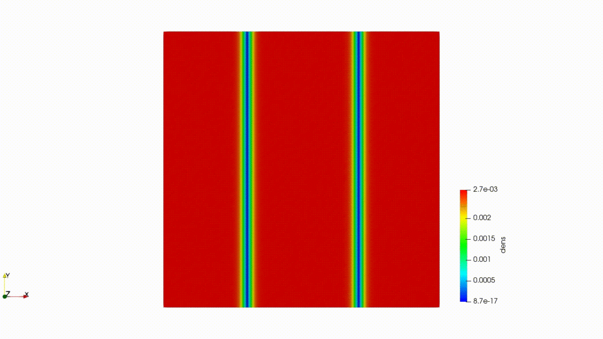
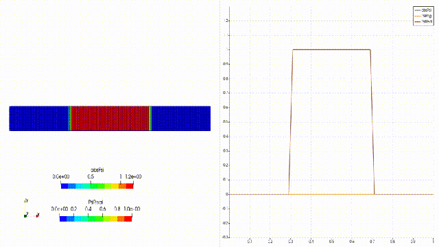
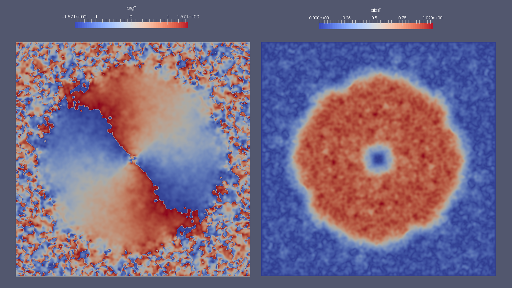
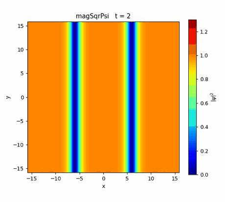

# OpenFOAM で Gross–Pitaevskii 方程式を解く（ダークソリトンの量子渦崩壊）

> ブログ用作業メモ。やったこと・考えたことを時系列＋論点別に記録する。

## 0. 目的

- OpenFOAM をカスタマイズして **Gross–Pitaevskii (GP) 方程式**（＝非線形シュレーディンガー方程式, NLSE）を解くソルバを作る。
- **2次元ダークソリトン**を初期状態にし、**横方向不安定性（snake instability）→ 量子渦の生成（vortex nucleation）** をシミュレーションする。
- できれば **初期状態を作る「虚時間発展」** と **本番の「実時間発展」** を **1つのソルバ**（モード切替）で共用する。
- ターゲット: OpenFOAM v2512（※後述、現環境は v2406）。

参考:
- 以前の失敗記録: note.com `nfb1ac8acad8b`（laplacianFoam 改造 + `docs/rep.pdf`）
- 崩壊シミュ元ネタ: takun-physics.net `/15338/`（2次元ダークソリトンの崩壊, Fortran コード）
- `docs/rep.pdf` … "Numerical solving of non-linear Schrödinger equation"（2011）

### 参照図版（元記事＝筆者自身の記事より）

**再現ターゲット（カマキリ記事の Fortran 計算結果）**



一様な背景（赤＝密度大）に、2本の低密度の溝（青い縦線＝ダークソリトン）が走る初期状態。時間発展でこの溝が横方向にくねり（snake instability）、やがて量子渦へと崩壊する。今回 OpenFOAM で再現したいのはこの現象。

**以前の OpenFOAM での試み（note 記事, laplacianFoam 改造）**



$\psi$ の実部・虚部・絶対値を可視化した1次元的なテスト。陽的オイラーで箱型初期波束を発展。数値スキームの問題（後述）で本格的な2次元崩壊までは到達できていなかった。

**関連：立方‑5次非線形ソリトン（Cubic‑Quintic）**



rep.pdf 後半で扱われている、符号の異なる2つの非線形項で安定化するソリトン（今回の主題からは外れるが背景として）。

---

## 1. 物理・定式化

### GP 方程式（無次元・一様系, 外部ポテンシャルなし）

$$
i\,\partial_t \psi = -\tfrac{1}{2}\nabla^2\psi + g\,|\psi|^2\psi \quad(+\,V_\mathrm{ext}\psi)
$$

- 背景密度 $n_0=|\psi_\infty|^2$、化学ポテンシャル $\mu=g n_0$、ヒーリング長 $\xi=1/\sqrt{2\mu}$（$\hbar=m=1$）。
- クリーンな無次元化として **$g=1,\ n_0=1,\ \xi=1$** を採用予定（kamakiri の Fortran は $a=7.2\times10^3$ の別スケール。OpenFOAM 版は $\xi\sim O(1)$ に揃えた方がメッシュ設計が楽）。

### 実部・虚部への分割（OpenFOAM は実スカラー場で扱う）

$\psi = u + i v$、$H\phi \equiv -\tfrac12\nabla^2\phi + (V+g(u^2+v^2))\phi$ とすると
$\partial_t\psi=-iH\psi$ より

$$\partial_t u = +H v,\qquad \partial_t v = -H u$$

（＝ $u,v$ が結合した2本の実方程式。ノルム保存＝ユニタリ。）

### 虚時間発展（初期状態＝基底状態／ソリトンを作る）

$t\to-i\tau$ で

$$\partial_\tau\psi = -H\psi + \mu\psi \quad\text{（各ステップで規格化 + }\mu\text{差引き）}$$

拡散型の実方程式。**同じ場・同じ演算子**を使い、フラグで切替可能 → 統一ソルバが成立する。

### なぜ虚時間発展で「基底状態（初期状態）」に落ち着くのか

**結論**：虚時間発展は「エネルギーの高い成分ほど速く減衰させる」フィルタになっていて、規格化を挟むと最終的に**最低エネルギー状態（基底状態）だけが生き残る**から。

**① 実時間は「位相が回る」だけ、虚時間は「振幅が減る」**

ハミルトニアン $H$ の固有状態を $H\phi_n=E_n\phi_n$（$E_0<E_1<\dots$）とし、任意の初期状態を重ね合わせで
$$\psi=\sum_n c_n\phi_n$$
と書く。実時間シュレーディンガー $i\partial_t\psi=H\psi$ の解は
$$\psi(t)=\sum_n c_n e^{-iE_n t/\hbar}\phi_n$$
で、各成分は**大きさを変えずに位相だけ回る**（$|e^{-iE_nt/\hbar}|=1$）。だから実時間ではいつまでも基底状態に落ちない。

ここで $t\to-i\tau$（時間を虚軸へ）と置き換えると $e^{-iE_nt/\hbar}\to e^{-E_n\tau/\hbar}$ となり、
$$\psi(\tau)=\sum_n c_n\,e^{-E_n\tau/\hbar}\,\phi_n$$
**位相回転が指数減衰に変わる。** これが虚時間発展の本質。

**② エネルギーが高い成分ほど速く消える → 基底状態が優勢に**

$E_n$ が大きいほど $e^{-E_n\tau/\hbar}$ は速く小さくなる。基底状態 $E_0$ を基準に括り出すと
$$\psi(\tau)=e^{-E_0\tau/\hbar}\Big(c_0\phi_0+\underbrace{c_1e^{-(E_1-E_0)\tau/\hbar}\phi_1+\cdots}_{\tau\to\infty\text{ で }0}\Big)$$
$E_1-E_0>0$ なので $\tau\to\infty$ で励起成分は基底成分に対して**相対的に**消え、$\psi\propto\phi_0$（基底状態）に収束する。

**③ 規格化（毎ステップ）で全体の減衰を打ち消す**

①②のままだと全体が $e^{-E_0\tau/\hbar}$ で0へ縮む。そこで**毎ステップ規格化**して $\int|\psi|^2=$一定 に戻す。これは全体の指数因子を割り算で消す操作で、「基底状態が相対的に優勢になる」効果だけが残る。式で書くと、規格化つき虚時間発展は
$$\partial_\tau\psi=-(H-\mu)\psi,\qquad \mu=\frac{\langle\psi|H|\psi\rangle}{\langle\psi|\psi\rangle}$$
に等しい（$\mu$＝規格化を保つための化学ポテンシャル）。収束すると $H\psi=\mu\psi$、つまり定常状態に到達したことになる。

> **一言でいうと**：実時間 $e^{-iEt}$（位相回転・大きさ不変）を、虚時間 $e^{-E\tau}$（大きさが減衰）に化けさせ、高エネルギー成分を優先的に捨てるのが虚時間発展。規格化を挟むことで「最低エネルギー＝基底状態」だけが残り、これを初期状態として使う。

**GP（非線形）での注意**：$H$ が $\psi$ に依存する（$g|\psi|^2$ 項）ため厳密な固有状態展開は使えないが、「エネルギー汎関数 $E[\psi]$ を勾配降下で下げていく操作」＝虚時間発展、という描像は不変。$\partial_\tau\psi=-\delta E/\delta\psi^*$（＋規格化拘束）なので、**エネルギーが単調に減り最小値（基底状態）に落ちる**。ダークソリトンのような「背景の上の励起状態」を作るときは、位相の飛びや密度の節をピン留め（対称性や壁ポテンシャル）して、基底状態へ落ち切らないように保持する。

---

## 2. 以前の失敗（rep.pdf）の原因分析

`docs/rep.pdf` の手法:
- laplacianFoam を改造、$\psi=T+iT_I$ に分割。
- **`fvc::laplacian`（陽的 = explicit Euler）** で時間積分。
- 曲線六面体メッシュ（円筒・球, snappyHexMesh）。

問題点:
1. **陽的オイラーは Courant 制限 $\Delta t \lesssim \Delta x^2$** が厳しく、容易に発散（rep.pdf 図3 "float overflow"）。
2. 曲線メッシュの**角で $\Delta x$ が極端に小さくなり**、そこから不安定が発生。
3. 複素係数 $C_0=1-i$ 等で人工減衰を入れて誤魔化していた（物理的でない）。

**対策（本プロジェクトの方針）:**
- **一様直交 2D メッシュ + 周期境界（cyclic）** … 角の特異性を排除、snake instability に必須の周期系。
- **半陰的スキーム**: ラプラシアンを **`fvm::laplacian`（陰的）** で、非線形項 $g|\psi|^2$ と $u\text{-}v$ 結合を**外部反復（PIMPLE 風 corrector）**で扱う。線形拡散部が無条件安定になり、はるかに頑健。
- 実時間は **Crank–Nicolson 相当**（ノルム/位相を保存）で。

---

## 3. ソルバ設計

- 名前（案）: `schrodingerFoam`（GP モード内蔵）。
- 場: `Psire` ($u$), `Psiim` ($v$)。派生: `magSqrPsi` = $u^2+v^2$。
- `constant/gpProperties`: `g`, `mode (imaginaryTime|realTime)`, `Vext` 設定等。
- 制御: `system/fvSolution` の `PIMPLE`/corrector 数、収束判定。
- 実時間: CN + 外部反復（結合項・非線形項を最新値でラグ更新）。
- 虚時間: 陰的拡散 + 毎ステップ規格化 + $\mu$ 差引き + 収束判定で停止 → 状態を書き出し実時間へ受け渡し。

### ディレクトリ構成（案）
```
schrodingerFoam/            # ソルバ本体
  schrodingerFoam.C
  createFields.H
  Make/{files,options}
run/01_darkSoliton_realTime/          # ケース
  0/{Psire,Psiim}
  constant/gpProperties
  system/{blockMeshDict,controlDict,fvSchemes,fvSolution}
notes.md                    # このメモ
```

---

## 4. メッシュ・初期条件・境界条件

- **2D 正方 [-L,L]²**、`empty` 方向 z、一様格子（例 256×256）。
- **周期境界（cyclic）** を x,y 両方向に。
- ダークソリトン初期形（kamakiri コード踏襲）:
  - 1本の溝: $\psi_0=\tanh(x/\sqrt2)$（$-\tfrac12\nabla^2$ に対応する係数）。
  - ソリトン対: $\psi_0\propto\tanh(x+x_0)\tanh(x-x_0)$。
  - **横方向に微小摂動**を加えて snake instability を種付け。
- 手順: 虚時間でクリーンなソリトンに緩和（必要なら壁ポテンシャルでピン留め）→ 実時間で崩壊。

---

## 5. 後処理・可視化

- $|\psi|^2$（密度）, $\arg\psi$（位相）。
- 超流速 $\mathbf v_s=\nabla(\arg\psi)$、渦度、位相 $2\pi$ 巻きで渦検出。
- ParaView / functionObject / Python。

---

## 6. 段階的実装ステップ

1. laplacianFoam から雛形生成、空ビルドでツールチェーン確認。
2. 線形シュレーディンガー（$g=0$）実時間 … ガウス波束の分散/平面波位相で検証。
3. 非線形項追加 … 1本ダークソリトンの定常性で検証。
4. 虚時間モード + 規格化 … 基底状態（一様）とソリトンで検証。
5. 2D 周期ケースで snake instability → 渦生成。
6. 後処理・可視化・動画化。

---

## 6.5 実装したもの（現状）

### ソルバ `schrodingerFoam`（統一版）

- 場：`Psire`($u$), `Psiim`($v$) の実スカラー2本。派生：`magSqrPsi`=$|\psi|^2$, `phase`=$\arg\psi$。
- 係数の次元は laplacianFoam 流に整合（`D`=ℏ/2m ~ m²/s, `g`,`Vext` ~ 1/s, $\psi$ 無次元）。
- `constant/gpProperties` の `mode` で切替：
  - **`realTime`**：Crank–Nicolson を Picard 反復（Gauss–Seidel）で解く。
    $$\partial_t u=+Hv,\quad \partial_t v=-Hu,\qquad H\phi=-D\nabla^2\phi+(V+g|\psi|^2)\phi$$
    $$u^{n+1}=u^n+\tfrac{\Delta t}{2}(Hv^{n+1}+Hv^n),\quad v^{n+1}=v^n-\tfrac{\Delta t}{2}(Hu^{n+1}+Hu^n)$$
  - **`imaginaryTime`**：$\partial_\tau\psi=D\nabla^2\psi-(W-\mu)\psi$ を**完全陰的**（`fvm::ddt`＋`fvm::laplacian`＋`fvm::SuSp`）で解く。$\mu=\langle\psi|H|\psi\rangle/\langle\psi|\psi\rangle$ を毎ステップ更新、`normalize`で規格化、`convergenceTol`で自動停止。

### なぜ「発散しない」のか（以前との決定的な違い）

以前の失敗は**陽的オイラー**。シュレーディンガー方程式 $\dot y=-iEy$ に陽的オイラーを使うと増幅率は
$$|1-iE\Delta t|=\sqrt{1+(E\Delta t)^2}>1$$
で、**$\Delta t$ をどれだけ小さくしても必ず1より大きい＝無条件不安定**。rep.pdf が $C_0=1-i$ の人工減衰を入れていたのはこのため。
Crank–Nicolson（台形則）は
$$\left|\frac{1-iE\Delta t/2}{1+iE\Delta t/2}\right|=1$$
で**増幅率がちょうど1＝ユニタリ（ノルム保存）**。これが今回発散しない理由。
→ 実測でも `norm` が計算中ずっと一定（例：224 で不変）を確認。

### メッシュ・ケース `run/01_darkSoliton_realTime`

- 2D 正方 $[-16,16]^2$、128×128（$\Delta x=0.25$）、z方向は `empty`。
- **周期境界 `cyclic`** を x,y 両方向に（snake instability に必須）。
- 単位系：$D=0.5,\ g=1,\ n_0=1\Rightarrow\mu=1,\ \xi=\sqrt{D/\mu}=0.707$。ダークソリトン幅 $\sqrt2\xi=1$。
- 初期条件（`0/Psire` を `#codeStream` で解析生成）：ダークソリトン対
  $$\psi_0=\tanh\!\frac{x+x_0-s(y)}{w}\cdot\tanh\!\frac{x-x_0-s(y)}{w},\quad s(y)=A\cos\frac{2\pi y}{\lambda_y}$$
  $w=1,\ x_0=6,\ A=0.25,\ \lambda_y=8$。横方向摂動 $s(y)$ で snake instability を種付け。$\psi_{\rm im}=0$（静止ブラックソリトン）。

### 実行手順（v2512）
```bash
openfoam2512 -c 'cd run/01_darkSoliton_realTime && blockMesh && schrodingerFoam'
```

### 検証状況
- [x] v2512 でビルド成功。
- [x] realTime：ノルム完全保存・NaN/FPE なし（陽的オイラーの発散を克服）。
- [x] imaginaryTime：調和トラップ基底状態が Thomas–Fermi と一致（case 02）。
- [x] snake instability → 渦核形成の可視化（case 01）。
- [x] 走る渦対（渦-反渦ダイポール）のデモ（case 03）。
- [ ] 線形($g{=}0$)の平面波位相・ガウス波束分散での定量検証（TODO）。

## 6.6 計算ケース一覧（run/ 以下・連番）

各フォルダに個別 `README.md`（仕様書）あり。共通単位系：$D=0.5,\ g=1\Rightarrow n_0=1,\ \mu=1,\ \xi=0.707$。

| # | フォルダ | モード | 何を見るか | 主要設定 |
|---|---|---|---|---|
| 01 | `01_darkSoliton_realTime` | realTime | ダークソリトン対の snake instability→渦核 | $[-16,16]^2$,128², cyclic, $\Delta t{=}0.005$, $t{\le}60$。初期 $\tanh$ 溝2本＋横摂動、$\psi_{\rm im}{=}0$ |
| 02 | `02_trap_imaginaryTime` | imaginaryTime | 調和トラップ基底状態（初期状態作成）、TF比較 | $[-12,12]^2$,128², wall, $\Delta\tau{=}0.05$, `normalize`,`targetNorm 20`,`convTol 1e-5`。$V{=}\tfrac12 r^2$ |
| 03 | `03_vortexDipole_realTime` | realTime | **走る渦対**（渦-反渦ダイポール） | $[-16,16]^2$,128², cyclic, $\Delta t{=}0.005$, $t{\le}80$。位相刷り込みダイポール $d{=}2.5$ |
| 04 | `04_darkSoliton_whiteNoise` | realTime | カマキリ流（**白色ノイズ種**）で不規則な渦崩壊 | $[-16,16]^2$,128², cyclic, $\Delta t{=}0.005$, $t{\le}150$。まっすぐソリトン＋ノイズ $n_o{=}10^{-2}$ |

### 結果図（`figures/`）
- `01_darkSoliton_realTime/density.gif` / `.../phase.gif` … case 01（密度・位相）
- `02_trap_imaginaryTime/groundstate.png` … case 02（基底状態＋TF比較。$\mu\to5.17$）
- `03_vortexDipole_realTime/density.gif` … case 03（走る渦対）

## 6.7 「渦（対）が走る／走らない」のなぜ

以前の note 記事（1次元・箱型初期条件）では密度の窪みが動く＝**走る**のに、
今回の case 01（ダークソリトン）は**その場でくびれるだけで走らない**。この違いの理由：

**① case 01 が走らない理由＝“静止＋対称”に作ったから**
- 初期の虚部を $\psi_{\rm im}=0$ にした ⇒ これは**速度ゼロのブラックソリトン**。ダークソリトンは
  $\psi=\sqrt{n_0}\big[i\,v/c+\sqrt{1-(v/c)^2}\tanh(\cdots)\big]$ で、$v=0$（虚部なし）だと並進しない。
- 摂動 $s(y)=A\cos(2\pi y/\lambda_y)$ が**左右対称** ⇒ 系全体の運動量が正味ゼロ。
  snake instability で生じる渦対も**対称配置**になり、互いに相殺して並進しない。

**② 渦対（ダイポール）が走る理由＝非対称だから（case 03 で実証）**
- 渦(+1)と反渦(‑1)がずれて対になると、各渦は相手が作る流れに乗って動き、
  **対全体が一定速度で並進**する（速度 $\sim(\hbar/m)/(2d)$、2渦を結ぶ線に垂直な向き）。
- これが「走る渦対」。case 03 は位相刷り込みでこのダイポールを直接作り、箱を横切って走らせた。

**③ note 記事（箱型）が走る理由も同じ**
- 箱型（top-hat）の鋭いエッジは**非平衡・局所位相勾配**をもつ。ダム崩壊のように
  エッジからグレーソリトン（有限速度の窪み）が生成され、内側へ**伝播＝走る**。

**まとめ（case 01 で走らせたいなら）**
1. グレーソリトンにする（$\psi_{\rm im}\neq0$ で初期速度を与える）。
2. 背景に一様な位相勾配（超流動流）を足す。
3. 摂動を非対称にする／局所的な1個の窪みにする。
4. もっと長時間回して渦対を解離・並進させる。
→ 最短の実証が case 03（渦対を直接置いて走らせる）。

## 6.8 可視化・GIF の作り方（手順）

OpenFOAM の結果 → PNG 連番 → GIF、という流れ。ParaView は使わず Python で自動化した。

**① OpenFOAM の場を VTK に書き出す（`foamToVTK`）**
```bash
# ケースディレクトリで（binary 出力を ascii の .vtu に変換）
openfoam2512 -c 'foamToVTK -fields "(magSqrPsi phase)" -ascii'
```
- 各書き出し時刻ごとに `VTK/<case>_<idx>/internal.vtu`（内部セルデータ）が作られる。
- 時刻の対応は `VTK/<case>.vtm.series`（JSON, `{"name":..,"time":..}`）に入っている。
- `magSqrPsi`=$|\psi|^2$（密度）, `phase`=$\arg\psi$（位相）はソルバが毎ステップ計算・出力している。

**② Python で .vtu を読み、格子に並べて着色 → PNG（`tools/render.py`）**
- `vtk` で `internal.vtu` を読み、`vtkCellCenters` でセル中心座標を取得。
- 一様格子なので、セル中心の $x,y$ から格子番号 `ix,iy` を作り
  `grid[iy,ix]=値` で 2D 配列に整列（`np.searchsorted` で bulletproof に並べ替え）。
- `matplotlib` の `imshow`（`cmap='jet'` 等、`vmin/vmax` 固定）でヒートマップ化し、
  時刻ごとに `field_0001.png`, `0002.png`, … と保存。

**③ PNG 連番を GIF に結合（PIL）**
- `render.py` の最後で `PIL.Image.save(..., save_all=True, append_images=..., duration=120, loop=0)`
  により PNG 群を 1 つの `field.gif` にまとめる。

**まとめて実行**
```bash
# 例：case 01 の密度と位相の GIF を作る
python3 tools/render.py run/01_darkSoliton_realTime/VTK figures/density magSqrPsi
python3 tools/render.py run/01_darkSoliton_realTime/VTK figures/phase    phase
```
- 出力：`figures/density/magSqrPsi.gif`, `figures/phase/phase.gif`（各 PNG も残る）。
- スクリプト本体：`tools/render.py`（引数：`<VTKディレクトリ> <出力先> <フィールド名>`）。

**必要ライブラリ**：`numpy`, `vtk`, `matplotlib`, `Pillow`（この環境には導入済み）。

> 補足：case 02（トラップ基底状態）はピーク密度が $\mu\approx5$ と大きいので、`render.py` の
> 既定 `vmax=1.3` ではなく専用スケール（`vmax=5.5`）＋径方向プロファイル比較を別途作図した。

## 6.9 背景の密度揺らぎ（音波放射）について

case 03 の背景が縦縞状に激しく揺らぐのは **音波（フォノン）の放射**。理由：
- 位相刷り込みの初期状態は GP の**厳密な定常解ではない**（コア密度を $\tanh(r/w)$ で近似）。
- 系が正しい形に緩和する際、**余剰エネルギーを密度波として放出** → これが縞。
- 周期境界で音波が反射・周回して干渉し、背景がチラつく。
- 渦対の並進（走る）そのものは正しく捉えられている。

**低減策**：① 虚時間で軽く緩和してから実時間へ（統一ソルバの強み。ブログ的にも良い実演）、
② 正しい渦コア関数 $f(r)=r/\sqrt{r^2+2\xi^2}$ を使う、③ 領域拡大／吸収境界。
→ 将来の case 04（虚時間緩和→実時間）で音波激減を実演する予定。

## 6.10 ソルバのコード解説（どこをどう触ったか・方程式との対応）

「laplacianFoam を改造して GP 方程式を解く」＝具体的にコードのどこを触ったかを、
方程式と一対一で対応させて説明する。

### 出発点：laplacianFoam（元のソルバ）

laplacianFoam は**実スカラー1本 $T$ の拡散方程式**をこれだけで解く：

```cpp
solve
(
    fvm::ddt(T) - fvm::laplacian(DT, T)   // dT/dt = DT lap(T)
);
```

`fvm::` は**陰的**（連立一次方程式の行列に組む）。単独の拡散方程式なのでこれで完結する。

### 触った点①：場を 1本 → 2本に（`createFields.H`）

複素波動関数 $\psi=u+iv$ を OpenFOAM の実スカラー場**2本**で表す。
`T` を消して `Psire`($u$), `Psiim`($v$) を追加。さらに外部ポテンシャル `Vext`、
後処理用の `magSqrPsi`($|\psi|^2$), `phase`($\arg\psi$) を追加した。

```cpp
volScalarField Psire(... "Psire" ...);   // 実部 u
volScalarField Psiim(... "Psiim" ...);   // 虚部 v
volScalarField Vext (... "Vext"  ...);   // 外部ポテンシャル（無ければ0）
dimensionedScalar D("D", dimensionSet(0,2,-1,...), gpProperties); // ℏ/2m
dimensionedScalar g("g", dimensionSet(0,0,-1,...), gpProperties); // 非線形係数
```

次元は laplacianFoam の `DT`（m²/s）に倣い、`D`=ℏ/2m を m²/s、`g`,`Vext` を 1/s とした
（こうすると `fvm::ddt` と `fvm::laplacian(D,·)` の次元が揃い、次元チェックが通る）。

### 触った点②：解く式を「拡散」→「GP（実部・虚部の連立）」に

解きたいのは
$$i\partial_t\psi=-D\nabla^2\psi+(V_{\rm ext}+g|\psi|^2)\psi\equiv H\psi.$$
$\psi=u+iv$ に分けると（$H$ は実演算子 $H\phi=-D\nabla^2\phi+W\phi$, $W=V_{\rm ext}+g|\psi|^2$）
$$\boxed{\ \partial_t u=+Hv,\qquad \partial_t v=-Hu\ }$$
laplacianFoam の「1本の拡散」を、この**2本の連立**に置き換えたのが改造の本体。

### 触った点③：実時間 = Crank–Nicolson を Picard 反復で（`realTime` ブロック）

以前の note 記事は `fvc::laplacian`（**陽的**）で前進オイラー → 無条件不安定だった。
ここでは時間平均をとる **Crank–Nicolson**
$$u^{n+1}=u^n+\tfrac{\Delta t}{2}(Hv^{n+1}+Hv^n),\quad
  v^{n+1}=v^n-\tfrac{\Delta t}{2}(Hu^{n+1}+Hu^n)$$
を、右辺の未知数を反復で埋める **Picard（Gauss–Seidel）ループ**で解く。コード：

```cpp
const volScalarField Psire0(Psire), Psiim0(Psiim);          // ← n ステップ目を保存
const volScalarField Hv0(-D*fvc::laplacian(Psiim0)+W0*Psiim0); // Hv^n
const volScalarField Hu0(-D*fvc::laplacian(Psire0)+W0*Psire0); // Hu^n

for (int corr = 0; corr < nCorr; ++corr)                    // ← 外部反復
{
    volScalarField W(Vext + g*(sqr(Psire)+sqr(Psiim)));     // W=V+g|psi|^2 を更新
    const volScalarField Hv(-D*fvc::laplacian(Psiim)+W*Psiim);  // Hv^{n+1}(最新)
    Psire = Psire0 + 0.5*dt*(Hv + Hv0);                     // u の CN 更新

    W = Vext + g*(sqr(Psire)+sqr(Psiim));                   // 更新した u で W 再計算
    const volScalarField Hu(-D*fvc::laplacian(Psire)+W*Psire);  // Hu^{n+1}
    Psiim = Psiim0 - 0.5*dt*(Hu + Hu0);                     // v の CN 更新
}
```

- ここは **`fvc::`（陽的）** で $H$ を「値」として評価している。行列を組まず、
  $u\leftrightarrow v$ の結合と非線形 $W$ を**反復で自己無撞着**に埋める。
- CN なので**増幅率がちょうど1＝ノルム保存**（実測で norm 一定）。以前の破綻を克服。
- 代償：この分離陽的ラプラシアンは Picard 収束のため $\Delta t\lesssim\Delta x^2/D$ が要る
  （一様メッシュなので予測可能。曲線メッシュの角で破綻した以前とは状況が違う）。

### 触った点④：虚時間 = 完全陰的＋規格化（`imaginaryTime` ブロック）

初期状態を作るモード。$\partial_\tau\psi=D\nabla^2\psi-(W-\mu)\psi$ は**実の拡散方程式**なので、
laplacianFoam と同じ **`fvm::`（陰的）** がそのまま使えて**無条件安定**（大きな $\Delta\tau$ 可）。
虚時間では $u,v$ が結合しない（各成分が独立に拡散）ので、成分ごとに陰的に解ける。

```cpp
volScalarField W("W", Vext + g*(sqr(Psire)+sqr(Psiim)));
// 化学ポテンシャル mu = <psi|H|psi> / <psi|psi>
dimensionedScalar mu =
    fvc::domainIntegrate(Psire*Hre + Psiim*Him)
  / fvc::domainIntegrate(sqr(Psire)+sqr(Psiim));

solve( fvm::ddt(Psire) - fvm::laplacian(D,Psire) + fvm::SuSp(W-mu, Psire) ); // ★陰的
solve( fvm::ddt(Psiim) - fvm::laplacian(D,Psiim) + fvm::SuSp(W-mu, Psiim) );

if (normalize) { /* 毎ステップ ∫|psi|^2 = targetNorm に規格化 */ }
```

- laplacianFoam の `fvm::ddt - fvm::laplacian` を**そのまま流用**し、`+ fvm::SuSp(W-mu, ·)`
  で GP のポテンシャル項（$V+g|\psi|^2$）と $\mu$ 引き算を陰的に足しただけ。
- `fvm::SuSp` は符号に応じて陰的/陽的を自動で選ぶ安定な足し方。
- 規格化と $\mu$ 引き算で「最低エネルギー状態だけ残す」（§1 の虚時間の原理）。

### まとめ：fvm と fvc（陰的/陽的）の使い分けが肝

| 場所 | 演算子 | なぜ |
|---|---|---|
| 虚時間のラプラシアン | `fvm::laplacian`（陰的） | 実拡散なので陰的が無条件安定、大 $\Delta\tau$ 可 |
| 実時間のラプラシアン | `fvc::laplacian`（陽的）＋CN＋反復 | $u,v$ 結合を分離して解くため。CN でノルム保存 |
| 以前の失敗 | `fvc::laplacian`＋前進オイラー | ノルムが必ず増える＝無条件不安定（人工減衰で誤魔化していた） |

→ **「laplacianFoam のどこを触ったか」= ①場を2本に ②式をGPの連立に ③実時間はCN反復に
④虚時間は陰的＋規格化を追加、の4点。** ソルバ先頭コメントにも同じ4点を明記済み。

## 6.11 カマキリ記事（本命ターゲット）との比較

カマキリ記事「2次元ダークソリトンの崩壊」の Fortran コードと本 case 01 を突き合わせる。
（本物のアニメGIF `https://takun-physics.net/wp-content/uploads/2023/02/animate.gif` を入手＝194フレーム。
 `figures/00_reference/ref_kamakiri_animate_full.gif`）

### カマキリの実際の崩壊過程（アニメで観察した3段階）
1. **初期**：2本の縦縞ダークソリトン（＝本 case 01 の初期と同じ形）。
2. **中期（~20%）**：縞が横に波打ち（snake）、**離散的な点渦の鎖にピンチオフ**（密度ゼロの青点が縦に並ぶ）。
3. **後期（~40%→終）**：点渦が全域に散り、**渦対で走り回る＝量子乱流**状態（渦十数個）。

→ 本 case 01（$t{=}60$）は **段階2 の手前（ビーズ化）** で止まっている。カマキリは桁違いに長く回して
  段階3（ピンチオフ→渦が走る→乱流）まで到達している。差は主に **走らせた時間と対称性の破れ**。

### 手法の対応表

| 項目 | カマキリ（Fortran） | 本 case 01 | 一致? |
|---|---|---|---|
| 初期形 | $\tanh(x+x_0)\tanh(x-x_0)$ ソリトン対 | 同じ | ✓ |
| 初期状態の準備 | **虚時間発展＋ピン留めマスク**（$k=0$ を $i_0, i_0+50$ に置く）で清浄化 | 解析式のまま（虚時間は未適用） | △ |
| 境界条件 | 周期 | 周期 | ✓ |
| 実時間スキーム | Crank–Nicolson | Crank–Nicolson（Picard反復） | ✓ |
| 渦の種 | マスク配置＋対の非対称性 | 明示的な横 cos 摂動（**左右対称**） | △ |
| 非線形の強さ | $a=7.2\times10^3$、$\int|\psi|^2{=}1$ 規格化（背景密度 $\sim2.7\times10^{-3}$） | $g{=}1, n_0{=}1$ | 別スケール |
| 格子 | $100^2$, $dx{=}0.2$（箱 $\sim20$） | $128^2$, $dx{=}0.25$（箱 $32$） | 近い |
| 走らせた時間 | `Fstep=1e6`（超長時間） | $t{=}60$（短め） | ✗ |
| 渦検出 | 位相 $2\pi$ 巻きでカウント（`cdlog(f_{i+1}f_i)/2\pi`）＋渦度・速度分布 | 未実装（位相図で目視） | ✗ |

### 結論：機構は同じ、到達段階が違う

- **同じもの**：初期のソリトン対・周期系・CN 実時間・**snake instability → 渦核の生成**という
  物理機構は再現できている（case 01 の $t{=}60$ で溝が密度ノードに分裂＝渦核形成の初期段階、
  位相図に渦‑反渦対の芽が見える）。
- **違うもの（＝カマキリのように渦が動き回らない理由）**：
  1. **走らせた時間が短い**：case 01 は崩壊の**初期（ビーズ化）**まで。カマキリは桁違いに長く回すので
     渦が完全に生成・解離して**動き回る**段階まで進む。
  2. **摂動が左右対称**：正味の運動量ゼロ → 生じる渦対が対称配置で相殺 → 走らない
     （カマキリはピン留め＋対配置で対称性が破れ、渦が非対称に生まれて動く）。
  3. **初期状態を虚時間で準備していない**：カマキリはピン留め虚時間で**清浄なソリトン**を作ってから
     実時間へ。本 case 01 は解析式そのままなので余分な音波が混じりやすい。

### カマキリを忠実に再現するには（＝統一ソルバの本来の使い方）
1. **虚時間発展でソリトンを準備**（密度の節をピン留め or 対称性で保持）→ 清浄な初期状態。
2. その状態を**実時間で長時間**回す（渦が生成・解離・運動する段階まで）。
3. **対称性を破る**（マスク／非対称摂動）で渦を動かす。
4. **渦検出**（位相 $2\pi$ 巻き）を後処理に追加して渦数の時間変化を出す。
→ これはまさに「初期状態は虚時間、崩壊は実時間、1つのソルバで」という当初要望そのもの。
   次の case 04 として実装予定（虚時間準備→長時間実時間→渦カウント）。

## 6.12 「崩壊にはノイズが要るのか？」＝種（seed）の話

**まっすぐで完全に清浄なダークソリトンは「不安定だが定常」な厳密解**。だから
**何らかの摂動（種）を与えないと snake instability は育たず、渦へ崩壊しない**
（数値丸め誤差からは崩壊しうるが、遅く・再現性がない）。

- **カマキリ**：虚時間で作った清浄ソリトン `K` に**白色ノイズ**を加える。
  ```fortran
  no = 0.1d0**4                              ! 振幅 1e-4
  f(i,j) = K(i,j) + no*fre1*cdexp(i*2*pi*fre2)! ランダム振幅fre1・位相fre2の複素ノイズ
  ```
  全波長を一様に励起 → 最速成長モードが勝つ → **不規則・乱流的**な渦配置。振幅が小さい(1e-4)ので
  育つのに長時間（~1e6ステップ）かかる。
- **本 case 01**：ノイズの代わりに**決定論的 cos 摂動** $s(y)=0.25\cos(2\pi y/8)$ を初期条件に埋め込み。
  これは snake モードの**直接的な種**。単一波長なので**規則的なビーズ**（1縞に4個、左右対称）になり、
  種が大きい(0.25)ので**速く**崩壊する。$A{=}0$ にすれば case 01 も崩壊しない。

→ どちらも役割は同じ「並進対称性を破って snake モードを種付けする」。ノイズ方式（カマキリ流）は
  **case 04** で実装：まっすぐなソリトン＋白色ノイズ＋長時間 → 不規則な渦乱流を狙う。

## 6.13 摂動なし対照ケース：不安定でも種がなければ崩壊しない

`run/04_darkSoliton_noSeed` を、白色ノイズケースと同じ領域・格子・時間刻み・終了時刻で実行した。
初期条件だけを厳密に $y$ 非依存とし、
$$u=\tanh((x+6)/1)\tanh((x-6)/1),\qquad v=0$$
として、横方向摂動も乱数も一切加えていない。

結果は **$t=150$ まで2本のソリトン縞が完全に直線のまま**だった。30,000ステップを通じて
ノルムは 224 を保持し、初期・中間（$t=22$）・最終のいずれでも、固定 $x$ に対する
$|\psi|^2$ の $y$ 方向レンジは数値上ちょうど 0。最終密度範囲は
$0.01575\leq|\psi|^2\leq1.00213$ だった。解析初期形が離散系の厳密定常解ではないため
$x$ 方向には小さな一様過渡応答があるが、snake instability の横波や渦は生じなかった。



この対照実験により、ダークソリトンが線形不安定であることと、完全対称な状態から有限時間で
自動的に崩壊することは別だと確認できた。**不安定モードを励起する seed が必要**であり、
白色ノイズケースの崩壊は数値解法が勝手に作った横方向破れではない。

## 6.14 2次元トラップ解放：量子と古典はどう違うか

`run/00_3_release2D` では、異方性調和トラップの2次元ガウス基底状態を $t=2$ で解放した。
初期密度幅を $(\sigma_x,\sigma_y)=(4,0.5)$ と極端な横長にした。狭く閉じ込められていた
y方向ほど速く膨張し、$t\approx6$ でほぼ円形、$t=10$ では縦長になる。OpenFOAMの最終幅
$(\sigma_x,\sigma_y)=(4.123,7.786)$ は解析値 $(4.123,8.016)$ とy方向2.9%以内で一致した。
$t=10$ では波束の裾がy境界へ達するため、外縁に弱い反射縞が生じる。

### 「古典なら膨張しない」は半分だけ正しい

解放時にすべての古典粒子が静止していれば、解放後は力も速度も0なので粒子は動かず、分布は
膨張しない。一方、量子基底状態は実波動関数なので確率流
$\boldsymbol j=\mathrm{Im}(\psi^*\nabla\psi)$ は0だが、運動量そのものが0に確定しているわけではない。
位置を狭く閉じ込めた方向ほど運動量幅が広い。トラップを切ると、この**零点運動量の幅**が
位置の広がりへ変換される。

初期形状を公平に比較するため、アニメ中央では量子と同じ位置幅 $(4,0.5)$ を用い、
解放時に等方的な速度幅
$$
\sigma_{v_x}=\sigma_{v_y}=1
$$
を与えた。解放後の幅は
$$
\sigma_j^2(\tau)=\sigma_{j0}^2+\tau^2
$$
なので、長時間後には方向によらない第2項が支配し、$\sigma_x/\sigma_y\to1$。$t=10$ では
$(8.94,8.02)$ となり、ほぼ円形になる。この古典ケースは初期位置分布を揃えるため解放前に
固定した比較用スナップショットであり、同じトラップ内の古典熱平衡そのものではない。

参考として、通常の古典熱平衡を同じ異方性トラップ・$k_BT/m=1$ で作る場合は
$\sigma_{j0}=1/\omega_j$ なので初期幅が $(32,0.5)$ となり、量子の初期幅とは一致しない。


左はOpenFOAM量子計算、中央は同じ初期密度に等方速度分散を与えた古典集団、右は解放時に
全粒子を静止させた古典集団。量子は縦長へ反転し、等方速度の古典集団は円形へ近づき、
静止集団は膨張しない。

> **結論**：量子基底状態は零点運動量幅が異方的なので縦横比が反転する。一方、単一温度の
> 古典熱平衡集団は速度幅が等方的なので円形へ近づく。なお、量子基底状態のWigner分布に合わせて
> 古典速度幅を人為的に異方化すれば量子と同じ膨張も作れるが、それは通常の等分配集団ではない。

## 6.15 次期研究：2次元量子乱流BECの自由膨張

渦なしの線形波束解放を基準として、次は $g>0$ の相互作用BEC、単一渦、少数渦対を検証し、
最終的に動的生成した2次元量子乱流を異方的トラップから解放する。総渦数だけでなく、偏極度、
双極子率、クラスタリング、圧縮性・非圧縮性エネルギーと膨張アスペクト比の関係を調べる。

先行研究、暫定的な研究ギャップ、評価式、ケース構成、数値検証条件は
[`docs/research_plan_2D_quantum_turbulence_free_expansion.md`](docs/research_plan_2D_quantum_turbulence_free_expansion.md)
に整理した。

## 6.16 OpenFOAM の complex クラス調査（v2512・2026-08-23）

勉強会で「OpenFOAM に複素数クラスがあるので、それを使えば実部・虚部に分けずに
書けるのでは」というコメントをもらったので、v2512（ESI版）のソース実体
（`/usr/lib/openfoam/openfoam2512/src`）を調査した。

### 結論

**complex クラスは v2512 にもあるが、「複素場の陰的ソルブ」には使えない。
実部 u・虚部 v を2つの `volScalarField` に分けて連立する現方式が正解。**

### 調査内容（証拠）

**あるもの**

- `primitives/complex/complex.H`（複素スカラー。四則・`sqrt/exp/log`・共役・`mag`）
- `fields/Fields/complex/complexField.H`（複素の `Field`。実部/虚部の zip/unzip）
- `complexVector` / `complexVectorField`

**ないもの（finiteVolume 側）**

- `GeometricField<complex>`（= volComplexField 相当）→ **実体なし**
- `fvMatrix<complex>` → **実体なし**。`fvMatrix`/`fvm::` がインスタンス化される型は
  `fieldTypes.H` の `FOR_ALL_FIELD_TYPES` マクロで
  **scalar / vector / sphericalTensor / symmTensor / tensor のみ**。
- `complexField` の使用先は **FFT・固有値（`EigenMatrix`）・式評価（expressions）だけ**で、
  finiteVolume では一切使われていない。

**根本的な理由（実装しても標準ソルバでは無理な理由）**

- 線形ソルバの基盤 `lduMatrix` の係数 `diag/upper/lower` は **`scalarField`（実数）**。
  行列係数に虚数を入れられない。
- CN更新 $(I+\tfrac{i\Delta t}{2}H)\psi^{n+1}=(I-\tfrac{i\Delta t}{2}H)\psi^{n}$ の
  左辺は**複素係数**なので、実係数 lduMatrix では表現不能。
- `fvMatrix<Type>`（vector等）は「各成分を**同じ実行列で独立に**解く」segregated 方式。
  complex を無理に載せても Re/Im が独立に解かれ、シュレーディンガーの連成
  （$\nabla^2 v \to \partial_t u$、$\nabla^2 u \to \partial_t v$）を陰的に表せず**誤った解**になる。
- 標準リリースに**ブロック連成行列は無い**（`fvBlockMatrix`/`BlockLduMatrix` は
  foam-extend 系のみ。v2512 には存在しない）。

### native complex でやりたい場合の選択肢

1. **PETSc 連携（petsc4Foam）**：v2512 に `etc/config.sh/petsc`・`have_petsc` あり。
   PETSc は複素数・ブロック連成系を扱えるので、複素係数の陰的系を外部ソルバで解ける。
   ただし導入・保守コストが高い。
2. **2×2 ブロック連成行列の自作**：foam-extend の `fvBlockMatrix` 相当を移植。大工事。
3. **現方式（採用）**：u, v の2本の `volScalarField` ＋ CN + Picard 反復。
   `fvm::` は scalar に完全対応しており、最も素直。

complex クラスが役立つのは「明示的な代数」（例：後処理で $\psi=u+iv$ を組んで
$e^{i\theta}$ を評価、FFT スペクトル解析）に限られる。

## 6.17 laplacianFoam からシュレーディンガー方程式を解く有効な手段（比較・2026-08-23）

6.16 の調査を踏まえ、実2場（u=Psire, v=Psiim）方式での時間積分法を比較する。
**鍵となる構造**：実時間の方程式 $\partial_t u=+Hv,\ \partial_t v=-Hu$ は
(u,v) について**純オフダイアゴナル**。u の式には u 自身が現れないため、
**segregated な `fvm::`（対角陰的）では実時間の連成を陰的化できない**。
これが本ソルバの realTime が `fvc::`（明示的評価）＋反復で書かれている理由である
（`fvm::` が意味を持つのは、各場が自分自身の拡散でダンプされる虚時間側のみ）。

### (A) 前進オイラー（不可）

増幅率 $|G|^2 = 1+(E\Delta t/\hbar)^2 > 1$ で**無条件不安定**（§2 参照）。

### (B) 現方式：CN（台形）＋ Picard 不動点反復（採用）

$\psi^{n+1}=\psi^n+\tfrac{\Delta t}{2}[F(\psi^{n+1})+F(\psi^n)]$ を
`fvc::laplacian` による明示評価の不動点反復（Gauss–Seidel、`nCorrectors` 回）で解く。

- 収束すれば**離散的にユニタリ**（CN＝ケーリー変換）。ノルム保存を実測確認済み。
- ただし**無条件安定ではない**。不動点反復の収束条件はおよそ
  $\Delta t \lesssim 2/\lVert H\rVert$。離散ラプラシアンの最大固有値は
  $4d/\Delta x^2$（$d$=次元）なので $\lVert H\rVert\approx 4dD/\Delta x^2 + W_{max}$。
  本ケース（2D, $D=0.5,\ \Delta x=0.25,\ W\sim1$）では
  $\lVert H\rVert\approx 65$、$\Delta t\,\lVert H\rVert/2\approx 0.16$（$\Delta t=0.005$）
  → 1反復あたり誤差が×0.16、4反復で $\sim 7\times10^{-4}$ まで縮む。
  `nCorrectors 4` が効く理由はこれ。**刻みを大きくしすぎると反復が発散**する
  （スケーリングは陽解法と同じ $\Delta t\propto\Delta x^2$、係数は緩い）。

### (C) Visscher の staggered 陽解法（有効な代替）

Visscher (1991)：u を整数ステップ、v を半整数ステップに置く leapfrog。
$u^{n+1}=u^n+\Delta t\,Hv^{n+1/2}$, $v^{n+3/2}=v^{n+1/2}-\Delta t\,Hu^{n+1}$。

- 反復不要（H 適用が各場1回/step）→ **現方式の約 1/nCorrectors のコスト**。
- 離散ノルム $u^n{}^2+v^{n+1/2}v^{n-1/2}$ を**厳密に保存**。
- 安定条件 $\Delta t\le 2/\lVert H\rVert$（＝(B) と同じスケーリング）。
- 純オフダイアゴナル構造をそのまま活かす、実時間専用の定番手法。

### (D) Strang 分割（非線形が強いときに有効）

$e^{-i(V+g|\psi|^2)\Delta t/2}\, e^{-iT\Delta t}\, e^{-i(V+g|\psi|^2)\Delta t/2}$。
ポテンシャル＋非線形ステップは各セルで (u,v) の**厳密な回転**
（$|\psi|^2$ はその間不変 → **Picard 不要・ノルム厳密保存**）。
運動項ステップだけ (B) か (C) で解く。2次精度。
スペクトル版が標準の TSSP（Bao–Jaksch–Markowich 2003）。
FV のままでも「非線形の反復を消す」効果があり、$g$ が大きい系で堅牢。

### (E) 完全陰的（複素 or ブロック連成）：刻み制限を外したい場合のみ

$\Delta t\propto\Delta x^2$ の制限を根本的に外すには (u,v) 連成の陰的解法が必要
＝ 6.16 の PETSc（petsc4Foam）連携 or ブロック行列自作。導入コスト大。
現在の解像度・時間刻みでは (B)(C) で十分なので不要。

### 結論

- **v2512 の枠内では、実2場＋(B) が正解**（実装済み・検証済み）。
- 速度が欲しくなったら **(C) Visscher** に置き換えるのが最有力
  （同じ刻み制限で反復コストが消え、ノルムも厳密保存）。
- $g$ を強くして Picard の収束が渋くなったら **(D) Strang 分割**で非線形を厳密化。
- 参考文献：Visscher, Computers in Physics 5, 596 (1991)／
  Bao, Jaksch & Markowich, J. Comput. Phys. 187, 318 (2003)／
  Antoine, Bao & Besse, Comput. Phys. Commun. 184, 2621 (2013)（レビュー）。

## 6.18 realTimeVisscher モード追加（実装済み・2026-08-23）

6.17(C) の Visscher staggered leap-frog を、既存の realTime / imaginaryTime を
無改造のまま**追加モード**として実装した（`mode realTimeVisscher`）。

### アルゴリズム

Re を整数ステップ、Im を半整数ステップに置く：

- 初期化（ループ前に一度）：`Psiim = Psiim - 0.5*dt*H*Psire`（$v^0\to v^{1/2}$）
- 各ステップ：
  1. `Psire = Psire + dt*H*Psiim`（$u^{n+1}=u^n+\Delta t\,Hv^{n+1/2}$）
  2. `Psiim = Psiim - dt*H*Psire`（$v^{n+3/2}=v^{n+1/2}-\Delta t\,Hu^{n+1}$）
- `H = -D*fvc::laplacian(・) + W*(・)`、`W = Vext + g|Psi|^2 - muEff`。
- muShift / dynamicMu / releaseTime は realTime と共通で使える。
- 反復なし。$W$（非線形項含む）は毎回いちばん新しい場から明示評価。

出力の密度・位相は staggered を同期して計算：
`magSqrPsi = sqr(Psire) + Psiim*PsiimPrev`（＝ $u^2+v_{n+1/2}v_{n-1/2}$、Visscher保存量）、
`phase = atan2(0.5*(Psiim+PsiimPrev), Psire)`。

### 検証（渦対 03_1、muShift=1、$\Delta t=0.005$、$t=0\to3$＝600ステップ）

| | 初期ノルム | 最終ノルム | ドリフト |
|---|---|---|---|
| realTime（CN+Picard, nCorr=4） | 253.8245 | 253.8245 | ≈0（ほぼ厳密） |
| realTimeVisscher | 253.8243 | 253.7457 | −0.031%（600step） |

- 両者の**初期ノルムが一致** → 実装が正しいことの確認。
- Visscher は明示スキームなので非線形項由来の $O(\Delta t^2)$ 微小ドリフトがあるが、
  600ステップで 0.03% と十分小さく、発散なし。
- **コスト**：Visscher は H適用が各場1回/step（計2回）。CN は nCorrectors=4 で
  ラプラシアン約8回/step → **Visscher は約1/4**。速度が欲しいときの置き換え候補。

### 使い方

`constant/gpProperties` で `mode realTimeVisscher;`（他は realTime と同じ設定でよい）。
安定条件 $\Delta t\lesssim 2/\lVert H\rVert$ は realTime と同じ。

## 7. 環境メモ

- インストール済み: `/usr/lib/openfoam/` に **openfoam2406 / openfoam2506 / openfoam2512** が併存。他に `/opt/openfoam13`（Foundation）。
- **`openfoam2512` コマンドで v2512 環境のシェルに切替**（`/usr/bin/openfoam2512` → `.../openfoam2512/etc/openfoam`）。
  - 非対話でビルド/実行: `openfoam2512 -c '<コマンド>'`（例: `openfoam2512 -c 'wmake'`）。API=2512 を確認済み。
- `cyclic`（周期境界）利用可能を確認済み。
- **ターゲットは v2512 で確定。** ビルド・実行確認も v2512 で行う。

### 作業ログ
- 2026-08-14: 資料調査（rep.pdf 全15頁、kamakiri Fortran コード）、失敗原因の特定、統一ソルバ方針の策定、本メモ作成。
- 2026-08-14: 環境確認。`openfoam2512 -c '...'` で v2512 上でビルド/実行できることを確認（API=2512）。
- 2026-08-14: 統一ソルバ `schrodingerFoam`（realTime/imaginaryTime）を実装・v2512 でビルド成功。
- 2026-08-14: case 01（ダークソリトン realTime）実行。ノルム保存・snake instability→渦核形成を確認。
- 2026-08-14: case 02（虚時間・調和トラップ基底状態）実行。$\mu\to5.17$、Thomas–Fermi と一致（虚時間発展の検証完了）。
- 2026-08-14: case 03（渦-反渦ダイポール realTime）実行。渦対が並進（走る）ことを実証（速度≈0.25、理論と一致）。
- 2026-08-14: `figures/` を 00_reference / 01_ / 02_ / 03_ の連番に再編。各 run ケースに README.md（仕様書）を追加。GIF 作成手順を本メモに記載。
- 2026-08-15: case 04 対照実験（摂動なし）を $t=150$ まで実行。$y$ 方向偏差 0、ノルム 224 を維持し、崩壊しないことを確認。
- 2026-08-15: case 04 白色ノイズありを $t=150$ まで完走。ソリトン縞の崩壊と多数の渦核を確認し、摂動なしとの比較GIFをX投稿用に圧縮生成。
- 2026-08-15: case 00_3（異方性2Dガウスのトラップ解放）を追加。$t=2$ で解放し、横長から縦長への自由膨張を解析解と1.6%以内で確認。

### 成果物ツリー（現状）
```
schrodingerFoam/            # 統一ソルバ（realTime + imaginaryTime）
  schrodingerFoam.C, createFields.H, Make/
run/
  00_1_tunneling_1D/       # 1次元量子トンネル（+README.md）
  00_2_harmonicOscillator_1D/ # 1次元調和振動子（+README.md）
  00_3_release2D/           # 異方性2Dガウスのトラップ解放（+README.md）
  01_darkSoliton_realTime/  # ダークソリトン→渦核（+README.md）
  02_trap_imaginaryTime/    # 虚時間：トラップ基底状態（+README.md）
  03_vortexDipole_realTime/ # 走る渦対（+README.md）
  04_darkSoliton_noSeed/    # 摂動なし対照実験（+README.md）
  04_darkSoliton_whiteNoise/# 白色ノイズ種で崩壊（+README.md、比較GIF）
tools/render.py             # VTK→PNG→GIF 自動化
figures/
  00_reference/  00_1_tunneling_1D/  00_2_harmonicOscillator_1D/  00_3_release2D/
  01_darkSoliton_realTime/  02_trap_imaginaryTime/  03_vortexDipole_realTime/
  04_darkSoliton_noSeed/  04_darkSoliton_whiteNoise/
notes.md                    # このメモ（ブログ用）
```
