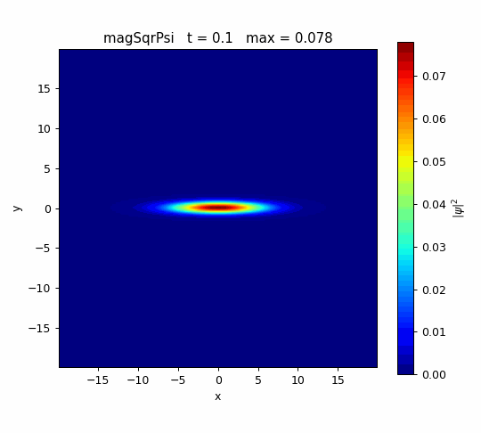

# 00_3_release2D — 異方性2次元ガウス波束のトラップ解放

線形シュレーディンガー方程式（$g=0$）を2次元で解く。中心に置いた **x方向に広く、
y方向に狭い**ガウス波束を異方性調和トラップ内で保持し、$t=2$ でトラップを突然切って
自由膨張させる。

## 物理

$$
i\partial_t\psi=-\tfrac12\nabla^2\psi+V(t)\psi,
\qquad
V(t<2)=\tfrac12(\omega_x^2x^2+\omega_y^2y^2),\quad V(t\ge2)=0,
$$

$$
\omega_x=0.03125,\qquad\omega_y=2,
\qquad
\psi(x,y,0)=\frac{(\omega_x\omega_y)^{1/4}}{\sqrt\pi}
e^{-(\omega_xx^2+\omega_yy^2)/2}.
$$

これは異方性トラップの厳密な基底状態なので、解放前は密度形状を保ち、位相だけが回る。
密度の標準偏差は解放時刻からの経過時間 $\tau=t-2$ に対して

$$
\sigma_j(\tau)=\frac{1}{\sqrt{2\omega_j}}\sqrt{1+(\omega_j\tau)^2}
\quad(j=x,y)
$$

と広がる。初期幅は $(\sigma_x,\sigma_y)=(4,0.5)$、縦横比は8で極端に横長である。
狭く閉じ込められたy方向ほど運動量幅が大きいため速く膨張し、
$t=2+1/\sqrt{\omega_x\omega_y}=6$
で縦横比が反転する。

## 数値設定

- 領域 $[-20,20]^2$、200×200セル（$\Delta x=\Delta y=0.2$）、z方向は `empty`。
- 外周は `fixedValue 0`。$t=10$ ではy方向の裾が境界へ達し、外縁付近に弱い反射縞が現れる。
  中央部の縦横比反転は明瞭だが、より長時間の定量評価にはy方向領域の拡大が必要。
- realTime、$D=0.5$、$g=0$、`nCorrectors 4`。
- $\Delta t=0.005$、$t\le10$、0.1ごとに保存。
- `releaseTime 2.0` により、ソルバ内部で $t\ge2$ の有効ポテンシャルを0にする。
- 波束が無視できる遠方では $V\le50$ に制限する。大きな箱の角でのみ生じる不要な
  ポテンシャル硬直性を避けるためで、中心部の調和基底状態には影響しない。

## 実行

```bash
openfoam2512 -c 'cd run/00_3_release2D && blockMesh && schrodingerFoam'
openfoam2512 -c 'cd run/00_3_release2D && foamToVTK -ascii'
python3 tools/render.py run/00_3_release2D/VTK figures/00_3_release2D magSqrPsi auto
```

## 結果

解放前は横長の楕円を維持する。$t=2$ 以降は初期に狭かったy方向へ急速に膨張し、円形を経て
縦長へ反転する。これは位置幅と運動量幅の不確定性による自由膨張である。

| 時刻 | $\sigma_x$（解析値） | $\sigma_y$（解析値） | $\sigma_x/\sigma_y$ |
|---:|---:|---:|---:|
| 0.0 | 4.0000 (4.0000) | 0.5000 (0.5000) | 8.0000 |
| 6.0 | 4.0310 (4.0311) | 3.9667 (4.0311) | 1.0162 |
| 10.0 | 4.1228 (4.1231) | 7.7859 (8.0156) | 0.5295 |

ノルムは全時刻で 0.2 を保存。$t=10$ の解析値との差はx方向0.01%未満、y方向2.9%。
y方向の差と外縁の弱い縞は有限領域の `fixedValue 0` 境界の影響である。



- `magSqrPsi.gif`: 各時刻のカラーバー上限を自動調整し、タイトルに最大密度を表示。形状変化用。
- `magSqrPsi_fixedScale.gif`: 全時刻で同じカラーバー範囲に固定。密度低下の比較用。
- `density_with_potential_section.gif`: 量子・古典の2次元密度に加え、$y=0$ と $x=0$ の
  ピーク規格化断面を固定軸で比較する。横向きの $x=0$ 断面には縦方向幅 $\sigma_y$ を表示。

## 古典力学との比較


比較GIFは次の3画面で構成する。

1. **量子（OpenFOAM）**：今回の $|\psi|^2$。
2. **同じ初期密度＋等方速度の古典集団**：量子と同じ初期位置幅から開始し、解放時に
   $\sigma_{v_x}=\sigma_{v_y}=1$ の速度分布を与える（解放前は位置を固定）。
3. **古典・全粒子静止**：解放時の速度を全粒子で0とした仮想集団（解放前は位置を固定）。

中央の古典集団では速度幅が等方的なので、解放後の幅は
$$
\sigma_j^2(\tau)=\sigma_{j0}^2+\sigma_v^2\tau^2
$$
となり、長時間後には $\sigma_x/\sigma_y\to1$、すなわち円形へ近づく。今回の量子基底状態は
y方向の零点運動量幅が大きいため、縦横比が反転して縦長になる。一方、3は $V=0$ かつ速度0
なので解放後も動かない。

中央と右は初期形状を揃えるため、解放前は位置を固定した比較用の準備状態であり、同じ調和
トラップ内の古典熱平衡そのものではない。通常の古典熱平衡を同じトラップ・$k_BT/m=1$ で
作ると、初期位置幅は $(1/\omega_x,1/\omega_y)=(32,0.5)$ となり、今回の有限領域を超える。

量子基底状態のWigner分布に合わせて古典速度幅を異方的に与えれば量子と同じ膨張も再現できるが、
それは通常の単一温度の等分配集団ではない。
