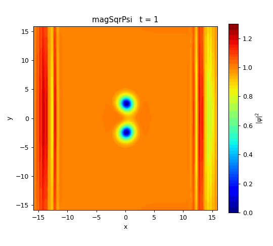
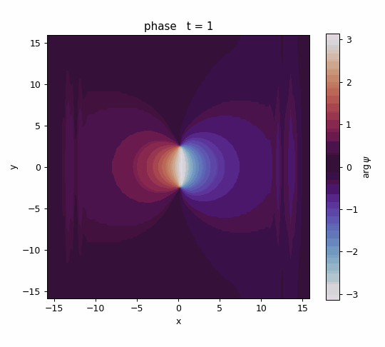

# 03_1_vortexDipole_muShift — 走る渦対（化学ポテンシャルを引いた版）

`03_vortexDipole_realTime` と**同一の物理・設定**で、実時間発展だけを
$i\partial_t\psi=(H-\mu)\psi$（$\mu$ を差し引く**回転系**）で解いた版。位相図の
背景がもつ大域位相 $e^{-i\mu t}$ の回転を取り除き、**位相のチラつきを消す**のが目的。

## 03 との違いは1点だけ

`constant/gpProperties` に次を追加している（一様背景 $n_0=1,\ g=1$ なので $\mu=g n_0=1$）。

```c
dynamicMu       false;   // 定数を引く
muShift         1.0;     // mu = g*n0 = 1
```

- `dynamicMu true` にすれば毎ステップ $\mu=\langle\psi|H|\psi\rangle/\langle\psi|\psi\rangle$ を計算して引く（トラップ系向き）。
- 既定（キー無し）は $\mu$ を引かない＝`03` と同じ。

## 物理・数値設定

`03_vortexDipole_realTime/README.md` と同じ（$[-16,16]^2$・$128^2$・周期境界、
$\Delta t=0.005$、$t\le80$、間隔 $d=2.5$ の渦-反渦対を位相刷り込みで配置）。

## 効果

- **密度 $\lvert\psi\rvert^2$**：$\mu$ の差し引きは大域位相なので密度は不変（`03` と同一）。
- **位相 $\arg\psi$**：`03` は背景が周期 $2\pi/\mu=2\pi$ で全色を巡回して点滅するが、
  本ケースは背景が静止し、**渦の $2\pi$ 巻きだけ**がくっきり見える。

理論の詳細は第1回ブログ「位相のチラつきを消す：化学ポテンシャルの差し引き（回転系）」を参照。

## 実行

```bash
openfoam2512 -c 'cd run/03_1_vortexDipole_muShift && blockMesh && schrodingerFoam'
openfoam2512 -c 'cd run/03_1_vortexDipole_muShift && foamToVTK -fields "(magSqrPsi phase)" -ascii'
python3 tools/render.py run/03_1_vortexDipole_muShift/VTK figures/03_1_vortexDipole_muShift/density magSqrPsi
python3 tools/render.py run/03_1_vortexDipole_muShift/VTK figures/03_1_vortexDipole_muShift/phase   phase
```

## 結果

| 密度 $\lvert\psi\rvert^2$ | 位相 $\arg\psi$（背景静止） |
|:---:|:---:|
|  |  |

`03`（μ引かない・点滅）との位相比較は `figures/03_1_vortexDipole_muShift/phase_compare_mu.gif`。
